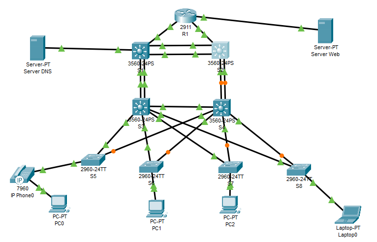

#  Разработка корпоративной отказоустойчивой сети для небольшого офиса
### Топология

### Таблица VLAN
| VLAN | Назначение | Подсеть | Маска | Шлюз по умолчанию | 
|------|-----------|----------|--------------|------------------|
10|Бухгалтерия (BUH) | 192.168.10.0/24 | 255.255.255.0 | 192.168.10.254
20|Маркетинг (MARKETING) | 192.168.20.0/24 | 255.255.255.0 | 192.168.20.254	
30|IT отдел (IT) | 192.168.30.0/24 | 255.255.255.0 | 192.168.30.254		
40|Руководство (MANAGEMENT) | 192.168.40.0/24 | 255.255.255.0 | 192.168.40.254	
100|Веб сервер (WEB_SERVER) | 192.168.100.0/24 | 255.255.255.0 | 192.168.100.1	
99|VLAN для неиспользуемых портов (ParkingLot)  | - | - | - |
999|Native VLAN (NATIVE) | - | - | - |
     
- Компьютеры в отделах Бухгалтерия, Маркетинг, Руководство получают IP-адреса по DHCP.     
- Сотрудники IT имеют статические адреса. 
- IP-адрес DNS сервера: 192.168.100.10
- IP-адрес Web сервера: 10.215.32.33/30
### Задачи
1. Создание сети и настройка основных параметров устройств 
2. Настройка VLAN, транков, избыточности
3. Настройка связующего дерева (STP)
4. Настройка маршрутизации
5. Настройка DHCP, вэб сервера и DNS сервера
6. Настройки безопасности
7. Проверка и тестирование доступности и отказоустойчивости сети
### Часть 1. Создание сети и настройка основных параметров устройства
#### Шаг 1. Создание сети
Создаем трехуровневую сеть: 
- на уровне ядра сети используем два коммутатора (S1 и S2), соединенные между собой двумя линками. Коммутаторы ядра подключены к коммутаторам уровня распределения также двумя линками каждый - для отказоустойчивости и обеспечения большей пропускной способности. К обоим коммутаторам ядра подключен роутер для выхода в интернет. Выход в интернет имитирует веб-сервер. 
- на уровне распределения используются L3 коммутаторы (S3 и S4) соединенные между собой гигабитной линией, каждый коммутатор подключен к каждому коммутатору уровня доступа.
- на уровне доступа используются собственные коммутаторы для каждого отдела (S5, S6, S7, S8).     
Подключаем устройства и подсоединяем необходимые кабели.
#### Шаг 2. Производим базовую настройку маршрутизатора.
Входим в привилегированный режим.    
Входим в режим глобальной конфигурации.   
Задаем имя маршрутизатору.   
Отключаем интерпретацию команды как DNS имя - на случай ввода команды с ошибкой.    
Включаем шифрование паролей.   
Устанавливаем пароль для доступа к маршрутизатору через консольный кабель и включаем доступ к пользовательскому режиму.   
Устанавливаем локальный пароль доступа в привилегированный режим консоли.   
Устанавливаем пароль VTY и включаем вход в систему по паролю.    
Задаем баннерное сообщение при входе в систему.    
Сохраняем текущую конфигурацию в файл загрузочной конфигурации.    
```
enable
configure terminal
hostname R1
no ip domain-lookup
service password-encryption
line console 0
password cisco
login
enable secret class
line vty 0 4
password cisco
login
banner motd @--- Unauthorized access is strictly prohibited ---@
exit
copy running-config startup-config
```
#### Шаг 3. Настраиваем базовые параметры каждого коммутатора.
Входим в привилегированный режим.    
Входим в режим глобальной конфигурации.   
Задаем имя коммутатора.   
Отключаем интерпретацию команды как DNS имя - на случай ввода команды с ошибкой.   
Включаем шифрование паролей.   
Устанавливаем пароль для доступа к коммутатору через консольный кабель и включаем доступ к пользовательскому режиму.   
Устанавливаем локальный пароль доступа в привилегированный режим консоли.   
Задаем баннерное сообщение при входе в систему.    
Сохраняем текущую конфигурацию в качестве начальной конфигурации.    
```
enable
configure terminal
hostname S1
no ip domain-lookup
service password-encryption
line console 0
password cisco
login
enable secret class
banner motd @--- Unauthorized access is strictly prohibited ---@
exit
copy running-config startup-config
```
**Повторяем процедуру для всех коммутаторов.**
### Часть 2. Настройка VLAN, транков, избыточности
#### Шаг 1. Создаем сети VLAN на коммутаторах.
Создаем необходимые VLAN и называем их на каждом коммутаторе из приведенной выше таблицы.
```
Vlan 10
name VLAN_BUH
exit
Vlan 20
name VLAN_MARKETING
exit
Vlan 30
name VLAN_IT
exit
Vlan 40
name VLAN_MANAGEMENT
exit
Vlan 100
name VLAN_WEB_SERVER
exit
Vlan 99
name ParkingLot
Vlan 999
name VLAN_NATIVE
exit
```
**Повторяем процедуру для всех коммутаторов.**
#### Шаг 2. Настраиваем транки и порты доступа, избыточность на уровне ядра.
На коммутаторе S1 настраиваем порт для подключения DNS-сервера    
```
interface fa0/24
switchport access vlan 100
switchport mode access
spanning-tree portfast
```
Настраиваем EtherChannel между коммутаторами S1 и S2:    
```
interface range fa0/5 - fa0/6
channel-group 1 mode active
interface Port-channel1
switchport trunk encapsulation dot1q
switchport mode trunk
switchport trunk allowed vlan 10,20,30,40,100,999
switchport trunk native vlan 999
```
Настраиваем интерфейсы для подключения коммутатора S3:    
```
interface range fa0/10 - fa0/11
channel-group 2 mode active
interface Port-channel2
switchport trunk encapsulation dot1q
switchport mode trunk
switchport trunk allowed vlan 10,20,30,40,100,999
switchport trunk native vlan 999
```
**Аналогично настраиваем коммутатор S2, исключая порт доступа к DNS серверу**
#### Шаг 3. Настраиваем транки и порты доступа, избыточность на уровне распределения.
Настраиваем соединение между коммутаторами уровня распределения (S3 и S4)     
```
interface g0/1
switchport mode trunk
switchport trunk allowed vlan 10,20,30,40,100,999
switchport trunk native vlan 999
```
Настраиваем подключение к S1 (через EtherChannel)
```
interface range fa0/10 - fa0/11
channel-group 1 mode active
interface Port-channel1
switchport mode trunk
switchport trunk allowed vlan 10,20,30,40,100,999
switchport trunk native vlan 999
```
Настраиваем порты для коммутаторов доступа
```
interface fa0/1
switchport mode access
switchport access vlan 10
spanning-tree portfast
interface fa0/2
switchport mode access
switchport access vlan 20
spanning-tree portfast
interface fa0/3
switchport mode access
switchport access vlan 30
spanning-tree portfast
interface fa0/4
switchport mode access
switchport access vlan 40
spanning-tree portfast
```
**Аналогично настраиваем коммутатор S4**
#### Шаг 4. Настраиваем транки и порты доступа, избыточность на уровне доступа.
Настраиваем соединения с S3 и S4 на коммутаторе S5:
```
interface fa0/1
switchport mode trunk
switchport trunk allowed vlan 10,20,30,40,999
switchport trunk native vlan 999
interface fa0/2
switchport mode trunk
switchport trunk allowed vlan 10,20,30,40,999
switchport trunk native vlan 999
```
Настраиваем порты для пользовательских ПК:
```
interface fa0/16
switchport mode access
switchport access vlan 10
spanning-tree portfast
```
**Аналогично настраиваем коммутаторы S6-S8**
#### Шаг 5. Настраиваем роутер R1
Настраиваем порт для подключения веб‑сервера
```
interface g0/2
ip address 10.215.32.34 255.255.255.252
no shutdown
```
Настраиваем подсети для VLAN через подинтерфейсы
```
interface g0/0
no ip address
no shutdown

interface g0/0.10
encapsulation dot1Q 10
ip address 192.168.10.254 255.255.255.0
interface g0/0.20
encapsulation dot1Q 20
ip address 192.168.20.254 255.255.255.0
interface g0/0.30
encapsulation dot1Q 30
ip address 192.168.30.254 255.255.255.0
interface g0/0.40
encapsulation dot1Q 40
ip address 192.168.40.254 255.255.255.0
interface g0/0.100
encapsulation dot1Q 100
ip address 192.168.100.1 255.255.255.0
interface g0/0.999
encapsulation dot1Q 999
```
Включаем маршрутизацию с помощью команды ***ip routing***.


