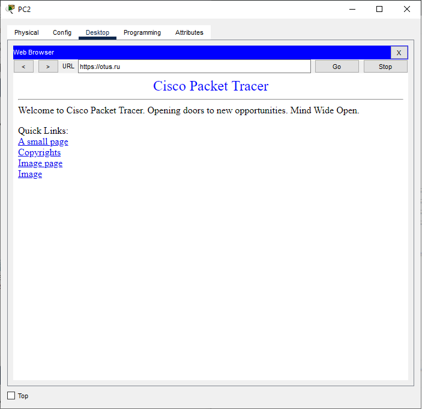

#  Разработка корпоративной отказоустойчивой сети для небольшого офиса
### Топология

### Таблица VLAN
| VLAN | Назначение | Подсеть | Маска | Шлюз по умолчанию | 
|------|-----------|----------|--------------|------------------|
10|Бухгалтерия (BUH) | 192.168.10.0/24 | 255.255.255.0 | 192.168.10.254
20|Маркетинг (MARKETING) | 192.168.20.0/24 | 255.255.255.0 | 192.168.20.254	
30|IT отдел (IT) | 192.168.30.0/24 | 255.255.255.0 | 192.168.30.254		
40|Руководство (MANAGEMENT) | 192.168.40.0/24 | 255.255.255.0 | 192.168.40.254	
100|Веб сервер (WEB_SERVER) | 192.168.100.0/24 | 255.255.255.0 | 192.168.100.1	
99|VLAN для неиспользуемых портов (ParkingLot)  | - | - | - |
999|Native VLAN (NATIVE) | - | - | - |
     
- Компьютеры в отделах Бухгалтерия, Маркетинг, Руководство получают IP-адреса по DHCP.     
- Сотрудники IT имеют статические адреса. 
- IP-адрес DNS сервера: 192.168.100.10
- IP-адрес Web сервера: 10.215.32.33/30
### Задачи
1. Создание сети и настройка основных параметров устройств 
2. Настройка VLAN, транков, избыточности
3. Настройка связующего дерева (STP)
4. Настройка маршрутизации и NAT
5. Настройка DHCP, вэб сервера и DNS сервера
6. Настройки безопасности
7. Проверка и тестирование доступности и отказоустойчивости сети
### Часть 1. Создание сети и настройка основных параметров устройства
#### Шаг 1. Создание сети
Создаем трехуровневую сеть: 
- на уровне ядра сети используем два коммутатора (S1 и S2), соединенные между собой двумя линками. Коммутаторы ядра подключены к коммутаторам уровня распределения также двумя линками каждый - для отказоустойчивости и обеспечения большей пропускной способности. К обоим коммутаторам ядра подключен роутер для выхода в интернет. Выход в интернет имитирует веб-сервер. 
- на уровне распределения используются L3 коммутаторы (S3 и S4) соединенные между собой гигабитной линией, каждый коммутатор подключен к каждому коммутатору уровня доступа.
- на уровне доступа используются собственные коммутаторы для каждого отдела (S5, S6, S7, S8).     
Подключаем устройства и подсоединяем необходимые кабели.
#### Шаг 2. Производим базовую настройку маршрутизатора.
Входим в привилегированный режим.    
Входим в режим глобальной конфигурации.   
Задаем имя маршрутизатору.   
Отключаем интерпретацию команды как DNS имя - на случай ввода команды с ошибкой.    
Включаем шифрование паролей.   
Устанавливаем пароль для доступа к маршрутизатору через консольный кабель и включаем доступ к пользовательскому режиму.   
Устанавливаем локальный пароль доступа в привилегированный режим консоли.   
Устанавливаем пароль VTY и включаем вход в систему по паролю.    
Задаем баннерное сообщение при входе в систему.    
Сохраняем текущую конфигурацию в файл загрузочной конфигурации.    
```
enable
configure terminal
hostname R1
no ip domain-lookup
service password-encryption
line console 0
password cisco
login
enable secret class
line vty 0 4
password cisco
login
banner motd @--- Unauthorized access is strictly prohibited ---@
exit
copy running-config startup-config
```
#### Шаг 3. Настраиваем базовые параметры каждого коммутатора.
Входим в привилегированный режим.    
Входим в режим глобальной конфигурации.   
Задаем имя коммутатора.   
Отключаем интерпретацию команды как DNS имя - на случай ввода команды с ошибкой.   
Включаем шифрование паролей.   
Устанавливаем пароль для доступа к коммутатору через консольный кабель и включаем доступ к пользовательскому режиму.   
Устанавливаем локальный пароль доступа в привилегированный режим консоли.   
Задаем баннерное сообщение при входе в систему.    
Сохраняем текущую конфигурацию в качестве начальной конфигурации.    
```
enable
configure terminal
hostname S1
no ip domain-lookup
service password-encryption
line console 0
password cisco
login
enable secret class
banner motd @--- Unauthorized access is strictly prohibited ---@
exit
copy running-config startup-config
```
**Повторяем процедуру для всех коммутаторов.**
### Часть 2. Настройка VLAN, транков, избыточности
#### Шаг 1. Создаем сети VLAN на коммутаторах.
Создаем необходимые VLAN и называем их на каждом коммутаторе из приведенной выше таблицы.
```
Vlan 10
name VLAN_BUH
exit
Vlan 20
name VLAN_MARKETING
exit
Vlan 30
name VLAN_IT
exit
Vlan 40
name VLAN_MANAGEMENT
exit
Vlan 100
name VLAN_WEB_SERVER
exit
Vlan 99
name ParkingLot
Vlan 999
name VLAN_NATIVE
exit
```
**Повторяем процедуру для всех коммутаторов.**
#### Шаг 2. Настраиваем транки и порты доступа, избыточность на уровне ядра.
На коммутаторе S1 настраиваем порт для подключения DNS-сервера    
```
interface fa0/24
switchport access vlan 100
switchport mode access
spanning-tree portfast
```
Настраиваем EtherChannel между коммутаторами S1 и S2:    
```
interface Port-channel1
switchport trunk encapsulation dot1q
switchport mode trunk
switchport trunk allowed vlan 10,20,30,40,100,999
switchport trunk native vlan 999
no shutdown
exit
interface range fa0/5 - fa0/6
channel-group 1 mode active
no shutdown
exit
```
Настраиваем интерфейсы для подключения коммутатора S3:    
```
interface Port-channel2
switchport trunk encapsulation dot1q
switchport mode trunk
switchport trunk allowed vlan 10,20,30,40,100,999
switchport trunk native vlan 999
no shutdown
exit
interface range fa0/10 - fa0/11
channel-group 2 mode active
no shutdown
exit
```
**Аналогично настраиваем коммутатор S2, исключая порт доступа к DNS серверу**
Проверяем с помощью команды ***show etherchannel summary***
```
S2#show etherchannel summary
Flags:  D - down        P - in port-channel
        I - stand-alone s - suspended
        H - Hot-standby (LACP only)
        R - Layer3      S - Layer2
        U - in use      f - failed to allocate aggregator
        u - unsuitable for bundling
        w - waiting to be aggregated
        d - default port

Number of channel-groups in use: 2
Number of aggregators:           2

Group  Port-channel  Protocol    Ports
------+-------------+-----------+----------------------------------------------

1      Po1(SD)           LACP   Fa0/5(I) Fa0/6(I) 
2      Po2(SD)           LACP   Fa0/10(I) Fa0/11(I) 
```
#### Шаг 3. Настраиваем транки и порты доступа, избыточность на уровне распределения.
Настраиваем соединение между коммутаторами уровня распределения (S3 и S4)     
```
interface g0/1
switchport mode trunk
switchport trunk allowed vlan 10,20,30,40,100,999
switchport trunk native vlan 999
```
Настраиваем подключение к S1 (через EtherChannel)
```
interface Port-channel1
switchport trunk encapsulation dot1q
switchport mode trunk
switchport trunk allowed vlan 10,20,30,40,100,999
switchport trunk native vlan 999
spanning-tree portfast trunk
no shutdown
exit
interface range fa0/10 - fa0/11
channel-group 1 mode active
no shutdown
```
Настраиваем подключение между S3 и S4
```
interface g0/1
switchport trunk encapsulation dot1q
switchport mode trunk
switchport trunk allowed vlan 10,20,30,40,100,999
switchport trunk native vlan 999
spanning-tree portfast trunk
no shutdown
```
Настраиваем порты для коммутаторов доступа
```
interface range fa0/1-4
switchport mode trunk
switchport trunk allowed vlan 10,20,30,40,100,999
switchport trunk native vlan 999
no shutdown
```
**Аналогично настраиваем коммутатор S4**
#### Шаг 4. Настраиваем транки и порты доступа, избыточность на уровне доступа.
Настраиваем соединения с S3 и S4 на коммутаторе S5:
```
interface fa0/1
switchport mode trunk
switchport trunk allowed vlan 10,20,30,40,100,999
switchport trunk native vlan 999
no shutdown
exit
interface fa0/2
switchport mode trunk
switchport trunk allowed vlan 10,20,30,40,100,999
switchport trunk native vlan 999
no shutdown
exit
```
Настраиваем порты для пользовательских ПК:
```
interface fa0/16
switchport mode access
switchport access vlan 10
spanning-tree portfast
spanning-tree bpduguard enable
```
**Аналогично настраиваем коммутаторы S6-S8**
### Часть 3. Настройка связующего дерева (STP)
#### Шаг 1. На всех коммутаторах включаем Rapid PVST+
Для запуска Rapid PVST+ используем команду ***spanning-tree mode rapid-pvst*** - на всех коммутаторах.    
#### Шаг 2. Устанавливаем приоритет для корневого моста
Коммутатор S1 будет основным корневым мостом
```
spanning-tree vlan 10 root primary
spanning-tree vlan 20 root primary
spanning-tree vlan 30 root primary
spanning-tree vlan 40 root primary
spanning-tree vlan 100 root primary
spanning-tree vlan 999 root primary
```
Коммутатор S2 будет резервным корневым мостом
```
spanning-tree vlan 10 root secondary
spanning-tree vlan 20 root secondary
spanning-tree vlan 30 root secondary
spanning-tree vlan 40 root secondary
spanning-tree vlan 100 root secondary
spanning-tree vlan 999 root secondary
```
На коммутаторах S3 и S4 устанавливаем приоритет вручную
```
spanning-tree vlan 10 priority 32768
spanning-tree vlan 20 priority 32768
spanning-tree vlan 30 priority 32768
spanning-tree vlan 40 priority 32768
spanning-tree vlan 100 priority 32768
spanning-tree vlan 999 priority 32768
```
#### Шаг 3. Настроим защиту от нежелательного корневого моста
Настроим Root Guard на всех транковых портах, подключённых к коммутаторам нижних уровней (от S1/S2 к S3/S4, и от S3/S4 к S5–S8), чтобы предотвратить превращение S3 или S4 в корневой мост.
```
На S1 и S2:
interface Port-channel2
spanning-tree guard root

На S3 и S4:
interface range fa0/1-4
spanning-tree guard root
```
### Часть 4. Настройка маршрутизации
#### Шаг 1. Настраиваем роутер R1
Настраиваем порт для подключения веб‑сервера
```
interface g0/2
ip address 10.215.32.34 255.255.255.252
no shutdown
```
Настраиваем подсети для VLAN через подинтерфейсы
```
interface g0/0
no ip address
no shutdown

interface g0/0.10
encapsulation dot1Q 10
ip address 192.168.10.1 255.255.255.0
interface g0/0.20
encapsulation dot1Q 20
ip address 192.168.20.1 255.255.255.0
interface g0/0.30
encapsulation dot1Q 30
ip address 192.168.30.1 255.255.255.0
interface g0/0.40
encapsulation dot1Q 40
ip address 192.168.40.1 255.255.255.0
interface g0/0.100
encapsulation dot1Q 100
ip address 192.168.100.1 255.255.255.0
interface g0/0.999
encapsulation dot1Q 999 native

interface g0/1
no ip address
no shutdown
```
Включаем маршрутизацию с помощью команды ***ip routing***.    
Проверяем связность: отправляем пинг от пользовательского ПК до шлюза 
```
C:\>ping 192.168.20.1

Pinging 192.168.20.1 with 32 bytes of data:

Reply from 192.168.20.1: bytes=32 time<1ms TTL=255
Reply from 192.168.20.1: bytes=32 time<1ms TTL=255
Reply from 192.168.20.1: bytes=32 time<1ms TTL=255
Reply from 192.168.20.1: bytes=32 time=1ms TTL=255

Ping statistics for 192.168.20.1:
    Packets: Sent = 4, Received = 4, Lost = 0 (0% loss),
Approximate round trip times in milli-seconds:
    Minimum = 0ms, Maximum = 0ms, Average = 0ms
```
Проверяем связность между пользовательскими ПК из разных VLAN: с компьютера из VLAN 10 отправляем пинг на компьютер из VLAN 30
```
C:\>ping 192.168.30.55

Pinging 192.168.30.55 with 32 bytes of data:

Request timed out.
Reply from 192.168.30.55: bytes=32 time=12ms TTL=127
Reply from 192.168.30.55: bytes=32 time<1ms TTL=127
Reply from 192.168.30.55: bytes=32 time=10ms TTL=127

Ping statistics for 192.168.30.55:
    Packets: Sent = 4, Received = 3, Lost = 1 (25% loss),
Approximate round trip times in milli-seconds:
    Minimum = 0ms, Maximum = 12ms, Average = 7ms
```
#### Шаг 2. Настраиваем OSPF на коммутаторах уровня распределения
Включаем маршрутизацию с помощью команды ***ip routing***.   
На коммутаторе S3 прописываем следующие настройки:    
1. Создаем SVI для каждого VLAN
```
interface Vlan10
ip address 192.168.10.4 255.255.255.0
description VLAN_BUH
no shutdown
```
**Повторяем для VLAN 20, 30, 40**     
2. Задаем настройки OSPF
```
router ospf 1
router-id 3.3.3.3
network 192.168.10.0 0.0.0.255 area 0
network 192.168.20.0 0.0.0.255 area 0
network 192.168.30.0 0.0.0.255 area 0
network 192.168.40.0 0.0.0.255 area 0
network 192.168.100.0 0.0.0.255 area 0
network 192.168.999.0 0.0.0.255 area 0
```
**Аналогичные настройки применяем на коммутаторе S4**      
Сохраняем конфигурации устройств с помощью команды ***copy running-config startup-config***.     
#### Шаг 3. Настраиваем HSRP для отказоустойчивости шлюзов
На маршрутизаторе R1 применяем следующие настройки: 
```
interface GigabitEthernet0/0.10
encapsulation dot1Q 10
ip address 192.168.10.1 255.255.255.0
standby 10 ip 192.168.10.254
standby 10 priority 110
standby 10 preempt
exit
```
**Аналогичные настройки делаем для VLAN 20,30,40**     
Настраиваем S2 в качестве резервного маршрутизатора   
```
interface Vlan10
ip address 192.168.10.2 255.255.255.0
standby 10 ip 192.168.10.254
standby 10 priority 90
standby 10 preempt
exit
```
**Аналогичные настройки делаем для VLAN 20,30,40**     
Перенастраиваем параметры IP на конечных устройствах - меняем шлюз на х.х.х.254     
Проверяем пинг до виртуального шлюза: 
```
C:\>ping -t 192.168.10.254

Pinging 192.168.10.254 with 32 bytes of data:

Reply from 192.168.10.254: bytes=32 time<1ms TTL=255
Reply from 192.168.10.254: bytes=32 time<1ms TTL=255
Reply from 192.168.10.254: bytes=32 time<1ms TTL=255
Reply from 192.168.10.254: bytes=32 time<1ms TTL=255
```
#### Шаг 4. Настройка NAT на маршрутизаторе R1
Настроим NAT так, чтобы ПК из VLAN 10, 20, 30, 40 могли подключаться к веб‑серверу 10.215.32.33    
Создаем список доступа, разрешающий трафик из всех внутренних подсетей
```
access-list 1 permit 192.168.10.0 0.0.0.255
access-list 1 permit 192.168.20.0 0.0.0.255
access-list 1 permit 192.168.30.0 0.0.0.255
access-list 1 permit 192.168.40.0 0.0.0.255
ip nat inside source list 1 interface GigabitEthernet0/2 overload
```
Задаем внутренний и внешний интерфейс:
```
interface g0/0
ip nat inside
exit
interface g0/2
ip nat outside
exit
```
### Часть 5. Настройка DHCP, Web-сервера и DNS-сервера
#### Шаг 1. Настройка DHCP
Настроим DHCP на коммутаторах S3 и S4 для VLAN 10, 20, 30:
1. Исключаем некоторые диапазоны
```
ip dhcp excluded-address 192.168.10.1 192.168.10.20
ip dhcp excluded-address 192.168.10.100 192.168.10.254
ip dhcp excluded-address 192.168.20.1 192.168.20.20
ip dhcp excluded-address 192.168.20.100 192.168.20.254
ip dhcp excluded-address 192.168.40.1 192.168.40.20
ip dhcp excluded-address 192.168.40.100 192.168.40.254
```
2. Создаём пул для VLAN 10
```
ip dhcp pool VLAN10_USERS
network 192.168.10.0 255.255.255.0
default-router 192.168.10.254
dns-server 192.168.100.10
domain-name otus.ru
```  
Настраиваем интерфейсы VLAN на коммутаторе
```
interface Vlan10
ip address 192.168.10.4 255.255.255.0
no shutdown
```
**Повторяем для VLAN 20, 30, 40**    
**Аналогично настраиваем резервный DHCP-сервер на коммутаторе S4** 
#### Шаг 2. Настраиваем Web-сервер и DNS-сервер
В настройках веб-сервера прописываем:
- IP-адрес 10.215.32.33
- маска подсети 255.255.255.252
- шлюз 10.215.32.34    
В настройках DNS-сервера прописываем:
- IP-адрес 192.168.100.10
- маска подсети 255.255.255.0
- шлюз 192.168.100.1
#### Шаг 3. Проверяем доступность Web сервера
С пользовательского ПК отправляем пинг запрос на Вэб-сервер
```
C:\>ping 10.215.32.33

Pinging 10.215.32.33 with 32 bytes of data:

Reply from 10.215.32.33: bytes=32 time<1ms TTL=127
Reply from 10.215.32.33: bytes=32 time<1ms TTL=127
Reply from 10.215.32.33: bytes=32 time=2ms TTL=127
Reply from 10.215.32.33: bytes=32 time<1ms TTL=127

Ping statistics for 10.215.32.33:
    Packets: Sent = 4, Received = 4, Lost = 0 (0% loss),
Approximate round trip times in milli-seconds:
    Minimum = 0ms, Maximum = 2ms, Average = 0ms
```
Также запускаем веб браузер и проходим по адресу https://otus.ru

### Часть 6. Настройка безопасности
#### Шаг 1. Настройка DHCP Snooping
Включаем DHCP Snooping на коммутаторах S3 и S4
```
ip dhcp snooping
ip dhcp snooping vlan 10,20,40
```
Настраиваем доверенные порты - к коммутатору ядра и второму коммутатору распределения
```
interface GigabitEthernet0/1
ip dhcp snooping trust
exit
interface GigabitEthernet0/2
ip dhcp snooping trust
```
#### Шаг 2. Настройка Port Security на портах доступа
Настраиваем Port Security на всех портах, к которым подключаются конечные устройства - коммутаторы уровня доступа S5 - S8
```
interface fa0/16
switchport port-security
switchport port-security maximum 2    (так как есть связки IP-телефон +ПК)
switchport port-security violation restrict
```
#### Шаг 3. Настройка ACL 
Нам необходимо запретить трафик из VLAN 10 и 20 до VLAN 30
```
ip access-list extended Block_VLAN10-20_to_VLAN30
deny ip 192.168.10.0 0.0.0.255 192.168.30.0 0.0.0.255
deny ip 192.168.20.0 0.0.0.255 192.168.30.0 0.0.0.255
permit ip any any
exit
interface Vlan 10
ip access-group Block_VLAN10-20_to_VLAN30 out
exit
interface Vlan 20
ip access-group Block_VLAN10-20_to_VLAN30 out
```
#### Шаг 4. Настройка всех сетевых устройств для доступа по SSH
Создаем локального пользователя с именем пользователя SSHadmin и зашифрованным паролем $cisco123!
Используем ccna-lab.com в качестве доменного имени.
Генерируем криптоключи с помощью 1024 битного модуля.
Включаем SSH версии 2.
Настраиваем первые пять линий VTY на каждом устройстве, чтобы поддерживать только SSH-соединения и с локальной аутентификацией.
```
username SSHadmin secret $cisco123!
ip domain-name ccna-lab.com
crypto key generate rsa
How many bits in the modulus [512]: 1024
ip ssh version 2
line vty 0 4
transport input ssh
login local
```
7. Проверка и тестирование доступности и отказоустойчивости сети
