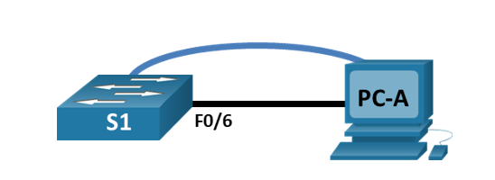

# Базовая настройка коммутатора

### Задачи:

 1. Проверить конфигурацию коммутатора по умолчанию
 2. Создать сеть и настроить основные параметры устройств: базовые параметры коммутатора, IP-адрес для ПК.
 3. Выполнить проверку сетевых подключений:
    - Отобразить конфигурацию устройства.
    - Протестировать сквозное соединение, отправив эхо-запрос.
    - Протестировать возможности удаленного управления с помощью Telnet.

### Топология 



### Таблица адресации

| Устройство  | Интерфейс | IP-адрес     | Маска подсети    |
|-------------|-----------|--------------|------------------|
| S1          | VLAN1     | 192.168.1.2  | 255.255.255.0    |
| PC-A        | NIC       | 192.168.1.10 | 255.255.255.0    |

### Создание сети и проверка настроек коммутатора по умолчанию

#### 1. Создание сети
Соединяем консольным кабелем коммутатор и компьютер.	Устанавливаем консольное подключение к коммутатору с компьютера PC-A с помощью программы эмуляции терминала.
#### 2. Проверка настроек коммутатора по умолчанию
Необходимо войти в привилегированный режим и просмотреть файл конфигурации.
```
enable
show running-config 
```
Убедились, что файл конфигурации не содержит настроек интерфейсов,  IP-адрес для сети VLAN1 не назначен.

### Настройка базовых параметров сетевых устройств
#### 1. Настройка базовых параметров коммутатора
Входим в режим глобальной конфигурации.   
Отключаем интерпретацию команды как DNS имя - на случай ввода команды с ошибкой.   
Задаем имя коммутатору.   
Включаем шифрование паролей.   
Устанавливаем пароль для доступа к коммутатору через консольный кабель и включаем доступ к пользовательскому режиму.   
Устанавливаем локальный пароль доступа в привилегированный режим консоли.   
Задаем баннерное сообщение при входе в систему.
```
configure terminal
no ip domain-lookup
hostname S1
service password-encryption
line console 0
password cisco
login
enable secret class
banner motd @--- Unauthorized access is strictly prohibited ---@
```
Назначаем IP-адрес и маску подсети интерфейсу SVI на коммутаторе, активируем интерфейс
```
interface vlan 1
ip address 192.168.1.2 255.255.255.0
no shutdown
```
Настраиваем каналы виртуального соединения для удаленного управления (vty) через Telnet
```
line vty 0 4
password cisco
login
transport input telnet
```
#### 2. Настройка IP-адреса на компьютере PC-A
Заходим в сетевые настройки компьютера, заполняем поля IP Configuration
```
IPv4 Address    192.168.1.10
Subnet Mask     255.255.255.0
Default Gateway 192.168.1.2
DNS Server      192.168.1.2
```
### Проверка сетевых подключений
#### 1. Отображение конфигурации коммутатора
Для просмотра текущей конфигурации коммутатора используем команду **show run** в привилегированном режиме
```
Building configuration...

Current configuration : 1310 bytes
!
version 15.0
no service pad
service timestamps debug datetime msec
service timestamps log datetime msec
service password-encryption
!
hostname S1
!
boot-start-marker
boot-end-marker
!
enable secret 5 $1$mtvC$6NC.1VKr3p6bj7YGE.jNg0
!
no aaa new-model
system mtu routing 1500 
!
!
no ip domain-lookup
!
<output omitted>
!
interface FastEthernet0/24
!
interface GigabitEthernet0/1
!
interface GigabitEthernet0/2
!
interface Vlan1
 ip address 192.168.1.2 255.255.255.0
 shutdown
!
banner motd ^C--- Unauthorized access is strictly prohibited ---^C
!
line con 0
 password 7 00071A150754
 login
line vty 0 4
 password 7 121A0C041104
 login
line vty 5 15
 login
!
end
```
Проверяем параметры VLAN1 используя команду **show interface vlan1** в привилегированном режиме
```
Vlan1 is up, line protocol is up
  Hardware is CPU Interface, address is 0090.0cac.8ab4 (bia 0090.0cac.8ab4)
  Internet address is 192.168.1.2/24
```

#### 2. Тестирование сквозного соединения
Отключаем от коммутатора и компьютера консольный кабель.    
В командной строке компьютера PC-A с помощью утилиты ping отправляем эхо-запрос на административный адрес интерфейса SVI коммутатора S1.   
```
C:\>ping 192.168.1.2

Pinging 192.168.1.2 with 32 bytes of data:

Request timed out.
Reply from 192.168.1.2: bytes=32 time<1ms TTL=255
Reply from 192.168.1.2: bytes=32 time<1ms TTL=255
Reply from 192.168.1.2: bytes=32 time<1ms TTL=255

Ping statistics for 192.168.1.2:
    Packets: Sent = 4, Received = 3, Lost = 1 (25% loss),
Approximate round trip times in milli-seconds:
    Minimum = 0ms, Maximum = 0ms, Average = 0ms
```
#### 3. Проверка удаленного управления коммутатором S1
Подключаемся к коммутатору S1, используя удаленный доступ к устройству с помощью Telnet.   
На компьютере запускаем программу эмуляции терминала с возможностью Telnet, указываем IP-адрес коммутатора.
Вводим пароль для доступа к пользовательсткому режиму, затем пароль для доступа к привилегированного режима.     
Сохраняем текущую конфигурацию с помощью команды **copy running-config startup-config**.
