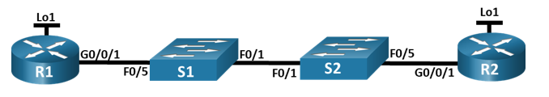

# Настройка протокола OSFPv2 для одной области
### Топология

### Таблица адресации
| Устройство  | Интерфейс | IP-адрес   | Маска подсети |
|-------------|-----------|------------|---------------|
|R1           |G0/0/1     |10.53.0.1   |255.255.255.0  |
|R1           |Loopback1  |172.16.1.1  |255.255.255.0  |
|R2           |G0/0/1     |10.53.0.2   |255.255.255.0  |
|R2           |Loopback1  |192.168.1.1 |255.255.255.0  |
### Цели
1. Создание сети и настройка основных параметров устройства
2. Настройка и проверка базовой работы протокола  OSPFv2 для одной области
3. Оптимизация и проверка конфигурации OSPFv2 для одной области
### Часть 1. Создание сети и настройка основных параметров устройства
#### Шаг 1. Создайте сеть согласно топологии.
Подключаем устройства, как показано в топологии, и подсоединяем необходимые кабели.
#### Шаг 2. Произведите базовую настройку маршрутизаторов.
Входим в привилегированный режим.    
Входим в режим глобальной конфигурации.   
Задаем имя маршрутизатору.   
Отключаем интерпретацию команды как DNS имя - на случай ввода команды с ошибкой.    
Включаем шифрование паролей.   
Устанавливаем пароль для доступа к маршрутизатору через консольный кабель и включаем доступ к пользовательскому режиму.   
Устанавливаем локальный пароль доступа в привилегированный режим консоли.   
Устанавливаем пароль VTY и включаем вход в систему по паролю.    
Задаем баннерное сообщение при входе в систему.    
Сохраняем текущую конфигурацию в файл загрузочной конфигурации.    
```
enable
configure terminal
hostname R1
no ip domain-lookup
service password-encryption
line console 0
password cisco
login
enable secret class
line vty 0 4
password cisco
login
banner motd @--- Unauthorized access is strictly prohibited ---@
exit
copy running-config startup-config
```
**Повторяем процедуру для второго маршрутизатора.**
#### Шаг 3. Настройте базовые параметры каждого коммутатора.
Входим в привилегированный режим.    
Входим в режим глобальной конфигурации.   
Отключаем интерпретацию команды как DNS имя - на случай ввода команды с ошибкой.   
Задаем имя коммутатора.   
Включаем шифрование паролей.   
Устанавливаем пароль для доступа к коммутатору через консольный кабель и включаем доступ к пользовательскому режиму.   
Устанавливаем локальный пароль доступа в привилегированный режим консоли.   
Задаем баннерное сообщение при входе в систему.    
Сохраняем текущую конфигурацию в качестве начальной конфигурации.    
```
enable
configure terminal
no ip domain-lookup
hostname S1
service password-encryption
line console 0
password cisco
login
enable secret class
banner motd @--- Unauthorized access is strictly prohibited ---@
exit
copy running-config startup-config
```
**Повторяем процедуру для второго коммутатора.**
### Часть 2. Настройка и проверка базовой работы протокола OSPFv2 для одной области
#### Шаг 1. Настройте адреса интерфейса и базового OSPFv2 на каждом маршрутизаторе.
Настраиваем адреса интерфейсов на каждом маршрутизаторе, как показано в таблице адресации выше.   
```
interface gigabitethernet 0/0/1
ip address 10.53.0.1 255.255.255.0
no shutdown
exit
interface loopback 1
ip address 172.16.1.1 255.255.255.0
no shutdown
exit
```
**Повторяем процедуру для второго коммутатора.**    
Переходим в режим конфигурации маршрутизатора OSPF, используя идентификатор процесса 56     
Настраиваем статический идентификатор маршрутизатора для каждого маршрутизатора (1.1.1.1 для R1, 2.2.2.2 для R2).    
```
router ospf 56
router-id 1.1.1.1
```
Настраиваем инструкцию сети для сети между R1 и R2, поместив ее в область 0.
```
network 10.53.0.0 0.0.0.255 area 0
```
Только на R2 добавляем конфигурацию, необходимую для объявления сети Loopback 1 в область OSPF 0.
```
network 192.168.1.1 0.0.0.0 area 0
```
Убеждаемся, что OSPFv2 работает между маршрутизаторами. Выполняем команду ***show ip ospf neighbor***, чтобы убедиться, что R1 и R2 сформировали смежность.
```
Neighbor ID     Pri   State           Dead Time   Address         Interface
2.2.2.2           1   FULL/BDR        00:00:36    10.53.0.2       GigabitEthernet0/0/1
```
*Маршрутизатор R2 является DR, маршрутизатор R1 является BDR.     
Критериями отбора являются приоритеты, в зависимости от интерфейсов устройств. Маршрутизатор с наибольшим приоритетом становится DR, маршрутизатор со вторым по величине приоритетом — BDR. В случае равенстра приоритетов сравниваются Router-ID. Маршрутизатор с наибольшим RID становится DR, второй по величине — BDR.*   
На R1 выполняем команду ***show ip route ospf***, чтобы убедиться, что сеть R2 Loopback1 присутствует в таблице маршрутизации. 
```
     192.168.1.0/32 is subnetted, 1 subnets
O       192.168.1.1 [110/2] via 10.53.0.2, 00:13:33, GigabitEthernet0/0/1
```
Запускаем Ping до адреса интерфейса R2 Loopback1 из R1:
```
Sending 5, 100-byte ICMP Echos to 192.168.1.1, timeout is 2 seconds:
!!!!!
Success rate is 100 percent (5/5), round-trip min/avg/max = 0/0/0 ms
```
### Часть 3. Оптимизация и проверка конфигурации OSPFv2 для одной области
#### Шаг 1. Реализация различных оптимизаций на каждом маршрутизаторе.
На R1 настраиваем приоритет OSPF интерфейса G0/0/1 на 50. 
```
interface gigabitethernet 0/0/1
ip ospf priority 50
```
Убеждаемся, что R1 является назначенным маршрутизатором, для этого выполняем команду ***show ip route ospf*** на R2
```
Neighbor ID     Pri   State           Dead Time   Address         Interface
1.1.1.1          50   FULL/DR         00:00:38    10.53.0.1       GigabitEthernet0/0/1
```
Настраиваем таймеры OSPF на G0/0/1 каждого маршрутизатора для таймера приветствия, составляющего 30 секунд.
```
interface gigabitethernet 0/0/1
ip ospf hello-interval 30
```
На R1 настраиваем статический маршрут по умолчанию, который использует интерфейс Loopback 1 в качестве интерфейса выхода.   
```
ip route 0.0.0.0 0.0.0.0 Loopback1
```
*Ошибка «Default route without gateway, if not a point-to-point interface, may impact performance» в Cisco возникает при настройке маршрута по умолчанию на интерфейсе, который не является интерфейсом point-to-point (p2p). Это предупреждение указывает на то, что маршрут не указывает адрес следующего хопа.*   
Распространяем маршрут по умолчанию в OSPF. 
```
router ospf 56
default-information originate
```
добавьте конфигурацию, необходимую для OSPF для обработки R2 Loopback 1 как сети точка-точка. Это приводит к тому, что OSPF объявляет Loopback 1 использует маску подсети интерфейса.


e.	Только на R2 добавьте конфигурацию, необходимую для предотвращения отправки объявлений OSPF в сеть Loopback 1.
f.	Измените базовую пропускную способность для маршрутизаторов. После этой настройки перезапустите OSPF с помощью команды clear ip ospf process . Обратите внимание на сообщение консоли после установки новой опорной полосы пропускания.


