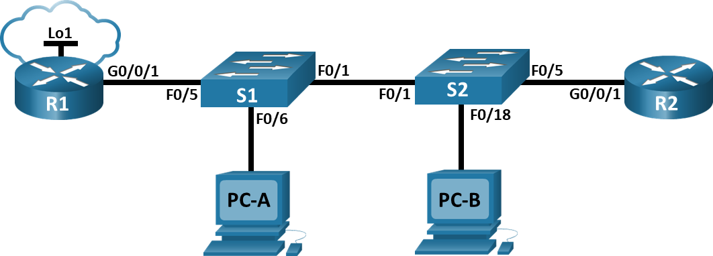

# Настройка и проверка расширенных списков контроля доступа
### Топология

### Таблица адресации
| Устройство | Интерфейс | IP‑адрес | Маска подсети | Шлюз по умолчанию |
|----------|-----------|----------|--------------|------------------|
| R1 | G0/0/1 | — | — | — |
| R1 | G0/0/1.20 | 10.20.0.1 | 255.255.255.0 | — |
| R1 | G0/0/1.30 | 10.30.0.1 | 255.255.255.0 | — |
| R1 | G0/0/1.40 | 10.40.0.1 | 255.255.255.0 | — |
| R1 | G0/0/1.1000 | — | — | — |
| R1 | Loopback1 | 172.16.1.1 | 255.255.255.0 | — |
| R2 | G0/0/1 | 10.20.0.4 | 255.255.255.0 | — |
| S1 | VLAN 20 | 10.20.0.2 | 255.255.255.0 | 10.20.0.1 |
| S2 | VLAN 20 | 10.20.0.3 | 255.255.255.0 | 10.20.0.1 |
| PC‑A | NIC | 10.30.0.10 | 255.255.255.0 | 10.30.0.1 |
| PC‑B | NIC | 10.40.0.10 | 255.255.255.0 | 10.40.0.1 |
### Таблица VLAN
| VLAN | Имя | Назначенный интерфейс |
|------|---------|--------------------|
| 20 | Management | S2: F0/5 |
| 30 | Operations | S1: F0/6 |
| 40 | Sales | S2: F0/18 |
| 999 | ParkingLot | S1: F0/2-4, F0/7-24, G0/1-2;    S2: F0/2-4, F0/6-17, F0/19-24, G0/1-2 |
| 1000 | Native | — |
### Задачи
1. Создание сети и настройка основных параметров устройства
2. Настройка и проверка списков расширенного контроля доступа
### Часть 1. Создание сети и настройка основных параметров устройства
#### Шаг 1. Создайте сеть согласно топологии.
Подключаем устройства, как показано в топологии, и подсоединяем необходимые кабели.
#### Шаг 2. Произведите базовую настройку маршрутизаторов.
Входим в привилегированный режим.    
Входим в режим глобальной конфигурации.   
Задаем имя маршрутизатору.   
Отключаем интерпретацию команды как DNS имя - на случай ввода команды с ошибкой.    
Включаем шифрование паролей.   
Устанавливаем пароль для доступа к маршрутизатору через консольный кабель и включаем доступ к пользовательскому режиму.   
Устанавливаем локальный пароль доступа в привилегированный режим консоли.   
Устанавливаем пароль VTY и включаем вход в систему по паролю.    
Задаем баннерное сообщение при входе в систему.    
Сохраняем текущую конфигурацию в файл загрузочной конфигурации.    
```
enable
configure terminal
hostname R1
no ip domain-lookup
service password-encryption
line console 0
password cisco
login
enable secret class
line vty 0 4
password cisco
login
banner motd @--- Unauthorized access is strictly prohibited ---@
exit
copy running-config startup-config
```
**Повторяем процедуру для второго маршрутизатора.**
#### Шаг 3. Настройте базовые параметры каждого коммутатора.
Входим в привилегированный режим.    
Входим в режим глобальной конфигурации.   
Задаем имя коммутатора.   
Отключаем интерпретацию команды как DNS имя - на случай ввода команды с ошибкой.   
Включаем шифрование паролей.   
Устанавливаем пароль для доступа к коммутатору через консольный кабель и включаем доступ к пользовательскому режиму.   
Устанавливаем локальный пароль доступа в привилегированный режим консоли.   
Задаем баннерное сообщение при входе в систему.    
Сохраняем текущую конфигурацию в качестве начальной конфигурации.    
```
enable
configure terminal
hostname S1
no ip domain-lookup
service password-encryption
line console 0
password cisco
login
enable secret class
banner motd @--- Unauthorized access is strictly prohibited ---@
exit
copy running-config startup-config
```
**Повторяем процедуру для второго коммутатора.**
### Часть 2. Настройка сетей VLAN на коммутаторах.
#### Шаг 1. Создайте сети VLAN на коммутаторах.
Откройте окно конфигурации
Создаем необходимые VLAN и называем их на каждом коммутаторе из приведенной выше таблицы.
```
vlan 20
name Management
vlan 30
name Operations
vlan 40
name Sales
vlan 999
name ParkingLot
vlan 1000
name Native
exit
```
Настраиваем интерфейс управления и шлюз по умолчанию на каждом коммутаторе, используя информацию об IP-адресе в таблице адресации. 
```
interface vlan 20
ip address 10.20.0.2 255.255.255.0
no shutdown
exit
ip default-gateway 10.20.0.1
```
Назначаем все неиспользуемые порты коммутатора VLAN Parking Lot, настраиваем их для статического режима доступа и административно деактивируем их.
```
interface range fastethernet 0/2-4, fastethernet 0/7-24, gigabitethernet 0/1-2
switchport mode access
switchport access vlan 999
shutdown
```
**Повторяем процедуру для второго коммутатора.**
#### Шаг 2. Назначьте сети VLAN соответствующим интерфейсам коммутатора.
Назначаем используемые порты соответствующей VLAN (указанной в таблице VLAN выше) и настраиваем их для режима статического доступа.
```
для коммутатора S1:
interface fastethernet 0/6
switchport mode access
switchport access vlan 30
no shutdown

для коммутатора S2:
interface fastethernet 0/5
switchport mode access
switchport access vlan 20
no shutdown
exit
interface fastethernet 0/18
switchport mode access
switchport access vlan 40
no shutdown
```
Выполняем команду ***show vlan brief***, чтобы убедиться, что сети VLAN назначены правильным интерфейсам.
```
S1#show vlan brief
VLAN Name                             Status    Ports
---- -------------------------------- --------- -------------------------------
1    default                          active    Fa0/1, Fa0/5
20   Management                       active    
30   Operations                       active    Fa0/6
40   Sales                            active    
999  ParkingLot                       active    Fa0/2, Fa0/3, Fa0/4, Fa0/7
                                                Fa0/8, Fa0/9, Fa0/10, Fa0/11
                                                Fa0/12, Fa0/13, Fa0/14, Fa0/15
                                                Fa0/16, Fa0/17, Fa0/18, Fa0/19
                                                Fa0/20, Fa0/21, Fa0/22, Fa0/23
                                                Fa0/24, Gig0/1, Gig0/2
1000 Native                           active    
1002 fddi-default                     active    
1003 token-ring-default               active    
1004 fddinet-default                  active    
1005 trnet-default                    active    
```
```
S2(config)#do show vlan brief

VLAN Name                             Status    Ports
---- -------------------------------- --------- -------------------------------
1    default                          active    Fa0/1
20   Management                       active    Fa0/5
30   Operations                       active    
40   Sales                            active    Fa0/18
999  ParkingLot                       active    Fa0/2, Fa0/3, Fa0/4, Fa0/6
                                                Fa0/7, Fa0/8, Fa0/9, Fa0/10
                                                Fa0/11, Fa0/12, Fa0/13, Fa0/14
                                                Fa0/15, Fa0/16, Fa0/17, Fa0/19
                                                Fa0/20, Fa0/21, Fa0/22, Fa0/23
                                                Fa0/24, Gig0/1, Gig0/2
1000 Native                           active    
1002 fddi-default                     active    
1003 token-ring-default               active    
1004 fddinet-default                  active    
1005 trnet-default                    active
```
### Часть 3. Настройте транки (магистральные каналы).
#### Шаг 1. Вручную настройте магистральный интерфейс F0/1.
Изменяем режим порта коммутатора на интерфейсе F0/1, чтобы принудительно создать магистральную связь.     
В рамках конфигурации транка устанавливаем для native vlan значение 1000 на обоих коммутаторах.     
В качестве другой части конфигурации транка указываем, что VLAN 20, 30, 40 и 1000 разрешены в транке.      
```
interface fastethernet 0/1
switchport mode trunk
switchport trunk native vlan 1000
switchport trunk allowed vlan 20,30,40,1000
```
**Проводим процедуру на обоих коммутаторах** 
Выполняем команду ***show interfaces trunk*** для проверки портов магистрали, собственной VLAN и разрешенных VLAN через магистраль.
```
S1(config)#do show interfaces trunk
Port        Mode         Encapsulation  Status        Native vlan
Fa0/1       on           802.1q         trunking      1000

Port        Vlans allowed on trunk
Fa0/1       20,30,40,1000

Port        Vlans allowed and active in management domain
Fa0/1       20,30,40,1000

Port        Vlans in spanning tree forwarding state and not pruned
Fa0/1       20,30,40,1000
```
```
S2(config)#do show interfaces trunk
Port        Mode         Encapsulation  Status        Native vlan
Fa0/1       on           802.1q         trunking      1000

Port        Vlans allowed on trunk
Fa0/1       20,30,40,1000

Port        Vlans allowed and active in management domain
Fa0/1       20,30,40,1000

Port        Vlans in spanning tree forwarding state and not pruned
Fa0/1       20,30,40,1000
```
#### Шаг 2. Вручную настройте магистральный интерфейс F0/5 на коммутаторе S1.
Настраиваем интерфейс S1 F0/5 с теми же параметрами транка, что и F0/1. Это транк до маршрутизатора.
```
interface fastethernet 0/5
switchport mode trunk
switchport trunk native vlan 1000
switchport trunk allowed vlan 20,30,40,1000
no shutdown
```
Сохраняем текущую конфигурацию в файл загрузочной конфигурации используя команду ***copy running-config startup-config***.     
Проверяем настройки транка, используя команду ***show interfaces trunk***: 
```
Port        Mode         Encapsulation  Status        Native vlan
Fa0/1       on           802.1q         trunking      1000
Fa0/5       on           802.1q         trunking      1000

Port        Vlans allowed on trunk
Fa0/1       20,30,40,1000
Fa0/5       20,30,40,1000

Port        Vlans allowed and active in management domain
Fa0/1       20,30,40,1000
Fa0/5       20,30,40,1000

Port        Vlans in spanning tree forwarding state and not pruned
Fa0/1       20,30,40,1000
Fa0/5       20,30,40,1000
```
### Часть 4. Настройте маршрутизацию.
#### Шаг 1. Настройка маршрутизации между сетями VLAN на R1.
Активируем интерфейс G0/0/1 на маршрутизаторе R1 с помощью команды ***no shutdown***.   
Настраиваем подинтерфейсы для каждой VLAN, как указано в таблице IP-адресации. Все подинтерфейсы используют инкапсуляцию 802.1Q. Убеждаемся, что подинтерфейс для собственной VLAN не имеет назначенного IP-адреса. Включаем описание для каждого подинтерфейса.
```
interface gigabitethernet 0/0/1.20
encapsulation dot1Q 20
ip address 10.20.0.1 255.255.255.0
description Management
exit
interface gigabitethernet 0/0/1.30
encapsulation dot1Q 30
ip address 10.30.0.1 255.255.255.0
description Operations
exit
interface gigabitethernet 0/0/1.40
encapsulation dot1Q 40
ip address 10.40.0.1 255.255.255.0
description Sales
exit
interface gigabitethernet 0/0/1.1000
encapsulation dot1Q 1000 native
description Native
no ip address
exit
```
Настраиваем интерфейс Loopback 1 на R1 с адресацией из приведенной выше таблицы.
```
interface loopback 1
ip address 172.16.1.1 255.255.255.0
no shutdown
```
С помощью команды ***show ip interface brief*** проверяем конфигурацию подынтерфейса:
```
Interface                  IP-Address      OK? Method Status                Protocol 
GigabitEthernet0/0/0       unassigned      YES unset  administratively down down 
GigabitEthernet0/0/1       unassigned      YES unset  up                    up 
GigabitEthernet0/0/1.20    10.20.0.1       YES manual up                    up 
GigabitEthernet0/0/1.30    10.30.0.1       YES manual up                    up 
GigabitEthernet0/0/1.40    10.40.0.1       YES manual up                    up 
GigabitEthernet0/0/1.1000  unassigned      YES unset  up                    up 
Loopback1                  172.16.1.1      YES manual up                    up 
Vlan1                      unassigned      YES unset  administratively down down
```
#### Шаг 2. Настройка интерфейса R2 g0/0/1 с использованием адреса из таблицы и маршрута по умолчанию с адресом следующего перехода 10.20.0.1
Настраиваем интерфейс G0/0/1 и указываем маршрут по умолчанию     
```
interface gigabitethernet 0/0/1
ip address 10.20.0.4 255.255.255.0
no shutdown
exit
ip route 0.0.0.0 0.0.0.0 10.20.0.1
```
### Часть 5. Настройте удаленный доступ
#### Шаг 1. Настройте все сетевые устройства для базовой поддержки SSH.
Создаем локального пользователя с именем пользователя SSHadmin и зашифрованным паролем $cisco123!    
Используем ccna-lab.com в качестве доменного имени.    
Генерируем криптоключи с помощью 1024 битного модуля.     
Включаем SSH версии 2.    
Настраиваем первые пять линий VTY на каждом устройстве, чтобы поддерживать только SSH-соединения и с локальной аутентификацией.
```
username SSHadmin secret $cisco123!
ip domain-name ccna-lab.com
crypto key generate rsa
How many bits in the modulus [512]: 1024
ip ssh version 2
line vty 0 4
transport input ssh
login local
```
#### Шаг 2. Включите защищенные веб-службы с проверкой подлинности на R1.
Включите сервер HTTPS на R1.
```
R1(config)# ip http secure-server
```
Настройте R1 для проверки подлинности пользователей, пытающихся подключиться к веб-серверу.
```
R1(config)# ip http authentication local
```
***В СРТ отсутствует функция запуска HTTP на маршрутизаторах***
### Часть 6. Проверка подключения
#### Шаг 1. Настройте узлы ПК.
Задаем IP-Адреса ПК в соответствии с таблицой адресации.
#### Шаг 2. Выполните следующие тесты. Эхозапрос должен пройти успешно.
| От | Протокол | Назначение | Результат |
| --- | --- | --- | --- |
| PC-A | Ping | 10.40.0.10 | + |
| PC-A | Ping | 10.20.0.1 | + |
| PC-B | Ping | 10.30.0.10 | + |
| PC-B | Ping | 10.20.0.1 | + |
| PC-B | Ping | 172.16.1.1 | + |
| PC-B | HTTPS | 10.20.0.1 |   |
| PC-B | HTTPS | 172.16.1.1 |   |
| PC-B | SSH | 10.20.0.1 | + |
| PC-B | SSH | 172.16.1.1 | + |
### Часть 7. Настройка и проверка списков контроля доступа (ACL)
**Политика 1.** Сеть Sales не может использовать SSH в сети Management (но в  другие сети SSH разрешен).     
**Политика 2.** Сеть Sales не имеет доступа к IP-адресам в сети Management с помощью любого веб-протокола (HTTP/HTTPS). Сеть Sales также не имеет доступа к интерфейсам R1 с помощью любого веб-протокола. Разрешён весь другой веб-трафик (обратите внимание — Сеть Sales  может получить доступ к интерфейсу Loopback 1 на R1).    
**Политика 3.** Сеть Sales не может отправлять эхо-запросы ICMP в сети Operations или Management. Разрешены эхо-запросы ICMP к другим адресатам.     
**Политика 4.** Cеть Operations  не может отправлять ICMP эхозапросы в сеть Sales. Разрешены эхо-запросы ICMP к другим адресатам.     
#### Шаг 1. Проанализируйте требования к сети и политике безопасности для планирования реализации ACL.
**Политика 1** запрещает трафик из Sales (10.40.0.0/24) в Management (10.20.0.0/24) по порту TCP 22 (SSH). Разрешено: SSH из сети Sales в остальные сети.

**Политика 2** запрещает трафик из Sales в Management по портам TCP 80 (HTTP) и TCP 443 (HTTPS), а также доступ из Sales к интерфейсам R1 по HTTP/HTTPS. Разрешено: веб‑трафик из Sales в остальные сети, кроме Management и интерфейсов R1. При этом доступ из сети Sales к Loopback 1 на R1 по HTTP/HTTPS разрешён.

**Политика 3** запрещает ICMP‑трафик из Sales в Operations (10.30.0.0/24) и Management (10.20.0.0/24). Разрешено: ICMP-трафик из Sales в другие сети.

**Политика 4** запрещает ICMP‑трафик из Operations (10.30.0.0/24) в Sales (10.40.0.0/24). Разрешено: ICMP из Operations в другие сети.    
#### Шаг 2. Разработка и применение расширенных списков доступа, которые будут соответствовать требованиям политики безопасности.
ACL для Политики 1
```
ip access-list extended SALES_OUT
deny tcp 10.40.0.0 0.0.0.255 10.20.0.0 0.0.0.255 eq 22
```
ACL для Политики 2
```
deny tcp 10.40.0.0 0.0.0.255 10.20.0.0 0.0.0.255 eq 80
deny tcp 10.40.0.0 0.0.0.255 10.20.0.0 0.0.0.255 eq 443
deny tcp 10.40.0.0 0.0.0.255 host 10.20.0.1 eq 80
deny tcp 10.40.0.0 0.0.0.255 host 10.20.0.1 eq 443
deny tcp 10.40.0.0 0.0.0.255 host 10.30.0.1 eq 80
deny tcp 10.40.0.0 0.0.0.255 host 10.30.0.1 eq 443
deny tcp 10.40.0.0 0.0.0.255 host 10.40.0.1 eq 80
deny tcp 10.40.0.0 0.0.0.255 host 10.40.0.1 eq 443
permit tcp 10.40.0.0 0.0.0.255 host 172.16.1.1 eq 80
permit tcp 10.40.0.0 0.0.0.255 host 172.16.1.1 eq 443
```
ACL для Политики 3
```
deny icmp 10.40.0.0 0.0.0.255 10.20.0.0 0.0.0.255
deny icmp 10.40.0.0 0.0.0.255 10.30.0.0 0.0.0.255
permit ip 10.40.0.0 0.0.0.255 any
```
Применяем ACL на подинтерфейсе G0/0/1.40 маршрутизатора R1 - вход из Sales.
```
interface gigabitethernet 0/0/1.40
ip access-group SALES_OUT out
```
ACL для Политики 4 
```
ip access-list extended OPERATIONS_OUT
deny icmp 10.30.0.0 0.0.0.255 10.40.0.0 0.0.0.255
permit ip 10.30.0.0 0.0.0.255 any
```
Применяем ACL на подинтерфейсе G0/0/1.30 маршрутизатора R1 - вход из Operations.
```
interface gigabitethernet 0/0/1.30
ip access-group OPERATIONS_OUT out
```
#### Шаг 3. Убедитесь, что политики безопасности применяются развернутыми списками доступа.
| От | Протокол | Назначение | Результат |
| --- | --- | --- | --- |
| PC-A | Ping | 10.40.0.10 | Сбой |
| PC-A | Ping | 10.20.0.1 | Успех |
| PC-B | Ping | 10.30.0.10 | Сбой |
| PC-B | Ping | 10.20.0.1 | Успех - должен быть сбой |
| PC-B | Ping | 172.16.1.1 | Успех |
| PC-B | HTTPS | 10.20.0.1 |   |
| PC-B | HTTPS | 172.16.1.1 |   |
| PC-B | SSH | 10.20.0.4 | Сбой |
| PC-B | SSH | 172.16.1.1 | Успех |
    
По итогам тестов мы увидели, что проходит пинг из сети Sales в сеть Management, поэтому необходимо добавить еще один ACL:
```
ip access-list extended MANAGEMENT_IN
deny icmp 10.40.0.0 0.0.0.255 10.20.0.0 0.0.0.255
permit ip any any
```
Применяем ACL на подинтерфейсе G0/0/1.20 маршрутизатора R1 - вход в Management.
```
interface gigabitethernet 0/0/1.20
ip access-group MANAGEMENT_IN in
```
в итоге пинг из сети Sales в сеть Management по-прежнему походит.
#### Исправление ошибок
В результате анализа и после тестирования было выявлено, что правило ACL SALES_OUT было применено на выход, а нужно было его применить на вход интерфейса G0/0/1.40 маршрутизатора R1
```
interface gigabitethernet 0/0/1.40
no ip access-group SALES_OUT out
exit
interface gigabitethernet 0/0/1.40
ip access-group SALES_OUT in
```
Также по результатам тестирования выяснилось, что правило MANAGEMENT_IN является избыточным, поэтому его просто отключаем.
```
interface gigabitethernet 0/0/1.40
no ip access-group MANAGEMENT_IN in
```
Проверяем еще раз работу политик безопасности: 
| От | Протокол | Назначение | Результат |
| --- | --- | --- | --- |
| PC-A | Ping | 10.40.0.10 | Сбой |
| PC-A | Ping | 10.20.0.1 | Успех |
| PC-B | Ping | 10.30.0.10 | Сбой |
| PC-B | Ping | 10.20.0.1 | Cбой |
| PC-B | Ping | 172.16.1.1 | Успех |
| PC-B | HTTPS | 10.20.0.1 |   |
| PC-B | HTTPS | 172.16.1.1 |   |
| PC-B | SSH | 10.20.0.4 | Сбой |
| PC-B | SSH | 172.16.1.1 | Успех 

Убеждаемся, что политики безопасности отрабатывают как положено.


