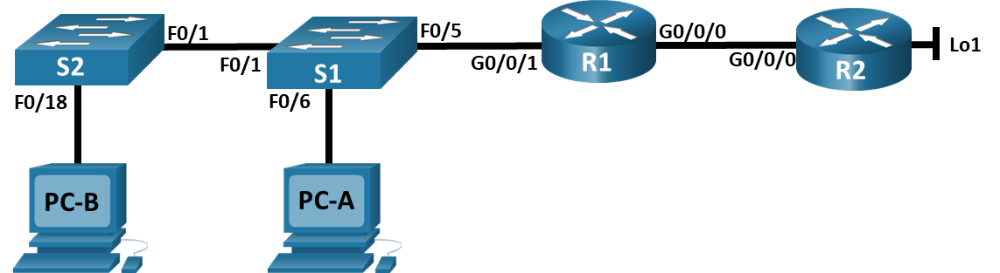

# Настройка NAT для IPv4
### Топология

### Таблица адресации
| Устройство | Интерфейс | IP‑адрес | Маска подсети |
|----------|----------|----------|--------------|
| R1 | G0/0/0 | 209.165.200.230 | 255.255.255.248 |
| R1 | G0/0/1 | 192.168.1.1 | 255.255.255.0 |
| R2 | G0/0/0 | 209.165.200.225 | 255.255.255.248 |
| R2 | Lo1 | 209.165.200.1 | 255.255.255.224 |
| S1 | VLAN 1 | 192.168.1.11 | 255.255.255.0 |
| S2 | VLAN 1 | 192.168.1.12 | 255.255.255.0 |
| PC‑A | NIC | 192.168.1.2 | 255.255.255.0 |
| PC‑B | NIC | 192.168.1.3 | 255.255.255.0 |
### Цели
1. Создание сети и настройка основных параметров устройства
2. Настройка и проверка NAT для IPv4
3. Настройка и проверка PAT для IPv4
4. Настройка и проверка статического NAT для IPv4.
### Часть 1. Создание сети и настройка основных параметров устройства
Создаем топологию сети и настраиваем базовые параметры для узлов ПК и коммутаторов.
#### Шаг 1. Подключите кабели сети согласно приведенной топологии.
Подключаем устройства, как показано в топологии, и подсоединяем необходимые кабели.
#### Шаг 2. Произведите базовую настройку маршрутизаторов.
Входим в привилегированный режим.    
Входим в режим глобальной конфигурации.   
Задаем имя маршрутизатору.   
Отключаем интерпретацию команды как DNS имя - на случай ввода команды с ошибкой.    
Включаем шифрование паролей.   
Устанавливаем пароль для доступа к маршрутизатору через консольный кабель и включаем доступ к пользовательскому режиму.   
Устанавливаем локальный пароль доступа в привилегированный режим консоли.   
Устанавливаем пароль VTY и включаем вход в систему по паролю.    
Задаем баннерное сообщение при входе в систему.    
```
enable
configure terminal
hostname R1
no ip domain-lookup
service password-encryption
line console 0
password cisco
login
enable secret class
line vty 0 4
password cisco
login
banner motd @--- Unauthorized access is strictly prohibited ---@
```
**Повторяем процедуру для второго маршрутизатора.**
Настраиваем IP-адресацию на R1:
```
interface GigabitEthernet 0/0/0
ip address 209.165.200.230 255.255.255.248
no shutdown
exit
interface GigabitEthernet 0/0/1
ip address 192.168.1.1 255.255.255.0
no shutdown
```
Настраиваем IP-адресацию на R2:
```
interface GigabitEthernet 0/0/0
ip address 209.165.200.225 255.255.255.248
no shutdown
exit
interface Loopback 1
ip address 209.165.200.1 255.255.255.224
no shutdown
```
Настраиваем маршрут по умолчанию от R2 до R1:
```
ip route 0.0.0.0 0.0.0.0 209.165.200.230
```
Сохраняем текущую конфигурацию в файл загрузочной конфигурации с помощью команды ***copy running-config startup-config***
#### Шаг 3. Настройте базовые параметры каждого коммутатора.
Входим в привилегированный режим.    
Входим в режим глобальной конфигурации.   
Задаем имя коммутатора.   
Отключаем интерпретацию команды как DNS имя - на случай ввода команды с ошибкой.   
Включаем шифрование паролей.   
Устанавливаем пароль для доступа к коммутатору через консольный кабель и включаем доступ к пользовательскому режиму.   
Устанавливаем локальный пароль доступа в привилегированный режим консоли.   
Задаем баннерное сообщение при входе в систему.    
Сохраняем текущую конфигурацию в качестве начальной конфигурации.    
```
enable
configure terminal
hostname S1
no ip domain-lookup
service password-encryption
line console 0
password cisco
login
enable secret class
banner motd @--- Unauthorized access is strictly prohibited ---@
exit
copy running-config startup-config
```
**Повторяем процедуру для второго коммутатора.**


