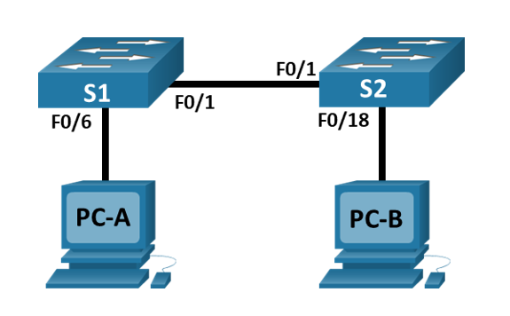

# Просмотр таблицы MAC-адресов коммутатора
### Цели работы
1. Создание и настройка сети
1. Изучение таблицы МАС-адресов коммутатора
### Топология 

### Таблица адресации
| Устройство  | Интерфейс | IP-адрес     | Маска подсети    |
|-------------|-----------|--------------|------------------|
| S1          | VLAN1     | 192.168.1.11 | 255.255.255.0    |
| S2          | VLAN1     | 192.168.1.12 | 255.255.255.0    |
| PC-A        | NIC       | 192.168.1.1  | 255.255.255.0    |
| PC-B        | NIC       | 192.168.1.2  | 255.255.255.0    |
## Создание и настройка сети
### 1. Создаем сеть в соответствии с топологией
1. В Cisco Packet Traser добавляем 2 коммутатора Cisco 2960 и 2 ПК.     
1. Консольные кабели для настройки устройств Cisco IOS соединяем через консольные порты с ПК.     
1. Кабели Ethernet соединяем в соответствии с топологией.
### 2. Настраиваем узлы ПК
Заходим в сетевые настройки компьютеров, заполняем поля IP Configuration
```
IPv4 Address    192.168.1.1              IPv4 Address    192.168.1.2
Subnet Mask     255.255.255.0            Subnet Mask     255.255.255.0
Default Gateway 192.168.1.11             Default Gateway 192.168.1.12
DNS Server      192.168.1.11             DNS Server      192.168.1.12
```
### 3. Настраиваем базовые параметры каждого коммутатора
Устанавливаем консольное подключение к коммутатору с компьютера PC-A с помощью программы эмуляции терминала.    
Входим в привилегированный режим
Входим в режим глобальной конфигурации.   
Отключаем интерпретацию команды как DNS имя - на случай ввода команды с ошибкой.   
Задаем имя коммутатору.   
Включаем шифрование паролей.   
Устанавливаем пароль для доступа к коммутатору через консольный кабель и включаем доступ к пользовательскому режиму.   
Устанавливаем локальный пароль доступа в привилегированный режим консоли.   
```
enable
configure terminal
no ip domain-lookup
hostname S1
service password-encryption
line console 0
password cisco
login
enable secret class
```
Назначаем IP-адрес и маску подсети интерфейсу SVI на коммутаторе, активируем интерфейс
```
interface vlan 1
ip address 192.168.1.11 255.255.255.0
no shutdown
```
Настраиваем каналы виртуального соединения для удаленного управления (vty) через Telnet
```
line vty 0 4
password cisco
login
transport input telnet
```
Отключаем от коммутатора и компьютера консольный кабель, проверяем связность с помощью Эхо-запроса из командной строки ПК, запускаем на ПК программу эмуляции терминала с возможностью Telnet и проверяем возможность удаленного управления коммутатором S1.   
**Повторяем процедуры для второго коммутатора S2. Устанавливаем IP адрес согласно таблицы адресации**
## Изучение таблицы МАС-адресов коммутатора
### Записыввем MAC-адреса сетевых устройств
Открываем командную строку на PC-A и PC-B и вводим команду ***ipconfig /all*** для отображения подробной информации о настройках всех сетевых адаптеров, присутствующих в системе.    
Подключаемся к коммутаторам S1 и S2 через консоль и введите команду ***show interface F0/1*** на каждом коммутаторе.
```
PC-A  Physical Address................: 0010.11A2.5034
PC-B  Physical Address................: 0002.1649.1146
S1    FastEthernet0/1 is up, line protocol is up (connected)
        Hardware is Lance, address is 000a.4176.5601 (bia 000a.4176.5601)
S2    FastEthernet0/1 is up, line protocol is up (connected)
        Hardware is Lance, address is 0006.2ac4.ba01 (bia 0006.2ac4.ba01)
```
### Просматриваем таблицу МАС-адресов коммутатора
Подключаемся к коммутатору S2 через консоль и входим в привилегированный режим EXEC. Вводим команду ***show mac address-table***
```
Mac Address Table
-------------------------------------------
Vlan    Mac Address       Type        Ports
----    -----------       --------    -----
   1    000a.4176.5602    DYNAMIC     Fa0/2
```
Мы видим MAC-адрес, сопоставленный с портом Fa0/2, похожий на физический адрес порта FastEthernet0/1 коммутатора S1
### Очищаем таблицу МАС-адресов коммутатора S2 и снова отображаем таблицу МАС-адресов.
В привилегированном режиме EXEC вводим команду ***clear mac address-table dynamic***, затем сразу вводим команду ***show mac address-table***    
```
Mac Address Table
-------------------------------------------
Vlan    Mac Address       Type        Ports
----    -----------       --------    -----
   1    000a.4176.5602    DYNAMIC     Fa0/2
```
Только в случае отключения кабеля Ethernet из порта Fa0/2 получилось полностью очистить таблицу MAC-адресов. 
### С компьютера PC-B отправляем эхо-запросы устройствам в сети и смотрим таблицу МАС-адресов коммутатора
На компьютере PC-B открываем командную строку и вводим команду ***arp -a***. 
```
  Internet Address      Physical Address      Type
  192.168.1.1           0010.11a2.5034        dynamic
  192.168.1.12          0001.c904.d228        dynamic
```
Видим физические и IP адреса компьютера PC-A и коммутатора S2.     
     
Из командной строки компьютера PC-B отправляем эхо-запросы на компьютер PC-A, а также коммутаторы S1 и S2. Получаем ответы от всех устройств.      
Также делаем с компьютера PC-A.   
      
Подключившись через консоль к коммутатору S2, вводим команду ***show mac address-table***. 
```
Mac Address Table
-------------------------------------------
Vlan    Mac Address       Type        Ports
----    -----------       --------    -----
   1    0002.1649.1146    DYNAMIC     Fa0/1
   1    000a.4176.5602    DYNAMIC     Fa0/2
   1    0010.11a2.5034    DYNAMIC     Fa0/2
```
Видим, что таблица физических адресов коммутатора S2 пополнилась адресами обоих ПК и коммутатора S2.    
     
На компьютере PC-B в командной строке и еще раз вводим команду ***arp -a***
```
Internet Address      Physical Address      Type
  192.168.1.1           0010.11a2.5034        dynamic
  192.168.1.11          0001.64d5.589e        dynamic
  192.168.1.12          0001.c904.d228        dynamic
```
Видим, что перечень дополнился физическим и IP адресом коммутатора S1.   
 
    
##### Мы убедились: данные в сети передаются по MAC‑адресам. Коммутаторы и компьютеры для этого автоматически создают ARP‑кэш и таблицы MAC‑адресов.
