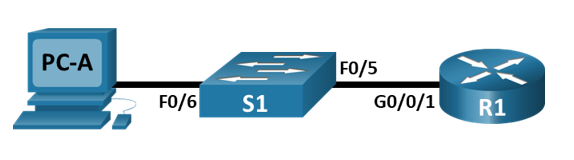

# Доступ к сетевым устройствам по протоколу SSH
### Топология

### Таблица адресации
| Устройство  | Интерфейс | IP-адрес     | Маска подсети    | Шлюз по умолчанию |
|-------------|-----------|--------------|------------------|-------------------|
| R1          | G0/0/1    | 192.168.1.1  | 255.255.255.0    |192.168.1.1        |
| S1          | VLAN1     | 192.168.1.11 | 255.255.255.0    |192.168.1.1        |
| PC-A        | NIC       | 192.168.1.3  | 255.255.255.0    |192.168.1.1        |
### Задачи:
 1. Настройка основных параметров устройства
 2. Настройка маршрутизатора для доступа по протоколу SSH
 3. Настройка коммутатора для доступа по протоколу SSH
 4. SSH через интерфейс командной строки (CLI) коммутатора
### 1. Настройка основных параметров устройства
В части 1 настраиваем топологию сети и основные параметры, такие как IP адреса интерфейсов, доступ к устройствам и пароли на маршрутизаторе.
#### Шаг 1. Создаем сеть согласно топологии
#### Шаг 2. Выполняем инициализацию и перезагрузку маршрутизатора и коммутатора
Подключаемся к маршрутизатору с помощью консоли.    
Входим в привилегированный режим.    
Входим в режим глобальной конфигурации.   
Задаем имя маршрутизатору и коммутатору.   
```
enable
configure terminal
hostname R1            hostname S1
```
### Шаг 3. Настройка коммутатора для доступа по протоколу SSH
Отключаем интерпретацию команды как DNS имя - на случай ввода команды с ошибкой.    
Включаем шифрование паролей.   
Устанавливаем пароль для доступа к коммутатору через консольный кабель и включаем доступ к пользовательскому режиму.   
Устанавливаем локальный пароль доступа в привилегированный режим консоли.   
Устанавливаем пароль VTY и включаем вход в систему по паролю.    
Задаем баннерное сообщение при входе в систему.
```
no ip domain-lookup
service password-encryption
line console 0
password cisco
login
enable secret class
line vty 0 4
password cisco
login
banner motd @--- Unauthorized access is strictly prohibited ---@
```
