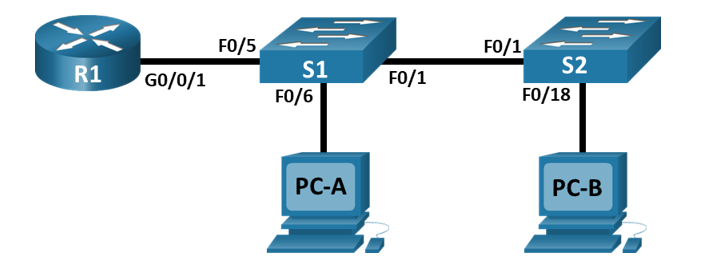

# Внедрение маршрутизации между виртуальными локальными сетями
### Топология

### Таблица адресации
| Устройство  | Интерфейс | IP-адрес   | Маска подсети | Шлюз по умолчанию | 
|-------------|-----------|------------|---------------|-------------------|
| R1          | G0/0/1.10 |192.168.10.1|255.255.255.0  | -                 |
|             | G0/0/1.20 |192.168.20.1|255.255.255.0  | -                 |
|             | G0/0/1.30 |192.168.30.1|255.255.255.0  | -                 |
|             |G0/0/1.1000| -          | -             | -                 |
| S1          | VLAN 10   |192.168.10.11|255.255.255.0 |192.168.10.1       |
| S2          | VLAN 10   |192.168.10.12|255.255.255.0 |192.168.10.1       |
| PC-A        | NIC       |192.168.20.3|255.255.255.0  |192.168.20.1       |
| PC-B        | NIC       |192.168.30.3|255.255.255.0  |192.168.30.1       |
### Таблица VLAN
| VLAN    | Имя          | Назначенный интерфейс |
|---------|--------------|---------------
|10       |Управление    |S1: VLAN 10            |
|         |              |S2: VLAN 10            |
|20       |Sales         |S1: F0/6    |
|30       |Operations    |S2: F0/18    |
|999 | Parking_Lot | С1: F0/2-4, F0/7-24, G0/1-2 |
|||С2: F0/2-17, F0/19-24, G0/1-2 | 
|1000| Собственная | - |
### Задачи
1. Создание сети и настройка основных параметров устройства
2. Создание сетей VLAN и назначение портов коммутатора
3. Настройка транка 802.1Q между коммутаторами.
4. Настройка маршрутизации между сетями VLAN
5. Проверка, что маршрутизация между VLAN работает
### 1. Создание сети и настройка основных параметров устройства
#### Шаг 1. Создайте сеть согласно топологии
Подключаем устройства, как показано в топологии, и подсоединяем необходимые кабели.
#### Шаг 2. Настройте базовые параметры для маршрутизатора
Подключаемся к маршрутизатору с помощью консоли.    
Входим в привилегированный режим.    
Входим в режим глобальной конфигурации.   
Задаем имя маршрутизатору.   
```
enable
configure terminal
hostname R1
```
Отключаем интерпретацию команды как DNS имя - на случай ввода команды с ошибкой.    
Включаем шифрование паролей.   
Устанавливаем пароль для доступа к коммутатору через консольный кабель и включаем доступ к пользовательскому режиму.   
Устанавливаем локальный пароль доступа в привилегированный режим консоли.   
Устанавливаем пароль VTY и включаем вход в систему по паролю.    
Задаем баннерное сообщение при входе в систему.    
Настраиваем на маршрутизаторе время.    
Сохраняем текущую конфигурацию в файл загрузочной конфигурации.    
```
no ip domain-lookup
service password-encryption
line console 0
password cisco
login
enable secret class
line vty 0 4
password cisco
login
banner motd @--- Unauthorized access is strictly prohibited ---@
exit
clock set 17:05:00 03 feb 2026
copy running-config startup-config
```
#### Шаг 3. Настройте базовые параметры каждого коммутатора
Входим в привилегированный режим.    
Входим в режим глобальной конфигурации.   
Отключаем интерпретацию команды как DNS имя - на случай ввода команды с ошибкой.   
Задаем имя коммутатора.   
Включаем шифрование паролей.   
Устанавливаем пароль для доступа к коммутатору через консольный кабель и включаем доступ к пользовательскому режиму.   
Устанавливаем локальный пароль доступа в привилегированный режим консоли.   
Задаем баннерное сообщение при входе в систему.    
Настраиваем на коммутаторе время.    
Сохраняем текущую конфигурацию в качестве начальной конфигурации.    
```
enable
configure terminal
no ip domain-lookup
hostname S1
service password-encryption
line console 0
password cisco
login
enable secret class
banner motd @--- Unauthorized access is strictly prohibited ---@
exit
clock set 17:06:00 03 feb 2026
copy running-config startup-config
```
**Повторяем процедуру для второго коммутатора.**
#### Шаг 4. Настройте узлы ПК
Настраиваем IP-адреса, маски подсети и шлюзы по умолчанию на узлах ПК в соответствии с таблицей адресации.
### 2. Создание сетей VLAN и назначение портов коммутатора
#### Шаг 1. Создаем сети VLAN на коммутаторах
Создаем и называем необходимые VLAN на каждом коммутаторе из таблицы выше.   
```
vlan 10
name Сontrol
vlan 20
name Sales
vlan 30
name Operations
vlan 999
name Parking_Lot
vlan 1000
name native
```
Настраиваем интерфейс управления и шлюз по умолчанию на каждом коммутаторе, используя информацию об IP-адресе в таблице адресации. 
```
interface vlan 10
ip address 192.168.10.11 255.255.255.0
no shutdown
exit
ip default-gateway 192.168.10.1
```
Назначаем все неиспользуемые порты коммутатора VLAN Parking_Lot, настраиваем их для статического режима доступа и административно деактивируем их.
```
interface range g0/1 - 2, fa0/2 - 4, fa0/7 - 24
switchport mode access
switchport access vlan 999
shutdown
```
**Повторяем процедуры для второго коммутатора.**
#### Шаг 2. Назначаем сети VLAN соответствующим интерфейсам коммутатора
Назначаем используемые порты соответствующей VLAN (указанной в таблице VLAN выше) и настраиваем их для режима статического доступа.      
Для коммутатора S1:
```
interface fa0/6
switchport mode access
switchport access vlan 20
```
Для коммутатора S2:
```
interface fa0/18
switchport mode access
switchport access vlan 30
```
Убеждаемся, что VLAN назначены на правильные интерфейсы, используем команду ***show vlan brief***.
```
VLAN Name                             Status    Ports
---- -------------------------------- --------- -------------------------------
1    default                          active    Fa0/1, Fa0/5
10   Control                          active    
20   Sales                            active    Fa0/6
30   Operations                       active    
999  Parking_Lot                      active    Fa0/2, Fa0/3, Fa0/4, Fa0/7
                                                Fa0/8, Fa0/9, Fa0/10, Fa0/11
                                                Fa0/12, Fa0/13, Fa0/14, Fa0/15
                                                Fa0/16, Fa0/17, Fa0/18, Fa0/19
                                                Fa0/20, Fa0/21, Fa0/22, Fa0/23
                                                Fa0/24, Gig0/1, Gig0/2
1000 native                           active    
1002 fddi-default                     active    
1003 token-ring-default               active    
1004 fddinet-default                  active    
1005 trnet-default                    active
```
### 3. Конфигурация магистрального канала стандарта 802.1Q между коммутаторами
#### Шаг 1. Вручную настраиваем магистральный интерфейс F0/1 на коммутаторах S1 и S2.
Настраиваем статический транкинг на интерфейсе F0/1 для обоих коммутаторов.    
Устанавливаем native VLAN 1000 на обоих коммутаторах.    
Указываем, что VLAN 10, 20, 30 и 1000 могут проходить по транку.    
```
interface fa0/1
switchport mode trunk
switchport trunk native vlan 1000
switchport trunk allowed vlan 10,20,30,1000
```
Проверяем транки, native VLAN и разрешенные VLAN через транк, используя команду ***show interface status***.
```
Port      Name               Status       Vlan       Duplex  Speed Type
Fa0/1                        connected    trunk      auto    auto  10/100BaseTX
Fa0/2                        disabled     999        auto    auto  10/100BaseTX
Fa0/3                        disabled     999        auto    auto  10/100BaseTX
Fa0/4                        disabled     999        auto    auto  10/100BaseTX
Fa0/5                        notconnect   1          auto    auto  10/100BaseTX
Fa0/6                        connected    20         auto    auto  10/100BaseTX
Fa0/7                        disabled     999        auto    auto  10/100BaseTX
Fa0/8                        disabled     999        auto    auto  10/100BaseTX
Fa0/9                        disabled     999        auto    auto  10/100BaseTX
Fa0/10                       disabled     999        auto    auto  10/100BaseTX
...
```
#### Шаг 2. Вручную настраиваем магистральный интерфейс F0/5 на коммутаторе S1.
Настраиваем интерфейс S1 F0/5 с теми же параметрами транка, что и F0/1. Это транк до маршрутизатора.
```
interface fa0/5
switchport mode trunk
switchport trunk native vlan 1000
switchport trunk allowed vlan 10,20,30,1000
```
Сохраняем текущую конфигурацию в файл загрузочной конфигурации с использованием команды ***copy running-config startup-config***.    
Проверяем транкинг: ***show interfaces trunk***.
```
Port        Mode         Encapsulation  Status        Native vlan
Fa0/1       on           802.1q         trunking      1000
Fa0/5       on           802.1q         trunking      1000

Port        Vlans allowed on trunk
Fa0/1       10,20,30,1000
Fa0/5       10,20,30,1000

Port        Vlans allowed and active in management domain
Fa0/1       10,20,30,1000
Fa0/5       10,20,30,1000

Port        Vlans in spanning tree forwarding state and not pruned
Fa0/1       10,20,30,1000
Fa0/5       10,20,30,1000
```
### 4. Настройка маршрутизации между сетями VLAN
#### Шаг 1. Настраиваем маршрутизатор.
Активируем интерфейс G0/0/1 на маршрутизаторе.
```
int g0/0/1
no shutdown
no ip address
```
Настраиваем подинтерфейсы для каждой VLAN, как указано в таблице IP-адресации. Все подинтерфейсы используют инкапсуляцию 802.1Q. Убеждаемся, что подинтерфейсу для native VLAN не назначен IP-адрес. Включаем описание для каждого подинтерфейса.
```
interface g0/0/1.10
encapsulation dot1Q 10
ip address 192.168.10.1 255.255.255.0
description VLAN_10_Control
exit
interface g0/0/1.20
encapsulation dot1Q 20
ip address 192.168.20.1 255.255.255.0
description VLAN_20_Sales
exit
interface g0/0/1.30
encapsulation dot1Q 30
ip address 192.168.30.1 255.255.255.0
description VLAN_30_Operations
exit
interface g0/0/1.1000
encapsulation dot1Q 1000 native
description VLAN_1000_native
exit
ip routing
```
Убеждаемся, что вспомогательные интерфейсы работают, используя команду ***show ip interface brief***.
```
Interface                  IP-Address      OK? Method Status                Protocol 
GigabitEthernet0/0/0       unassigned      YES unset  administratively down down 
GigabitEthernet0/0/1       unassigned      YES unset  up                    up 
GigabitEthernet0/0/1.10    192.168.10.1    YES manual up                    up 
GigabitEthernet0/0/1.20    192.168.20.1    YES manual up                    up 
GigabitEthernet0/0/1.30    192.168.30.1    YES manual up                    up 
GigabitEthernet0/0/1.1000  unassigned      YES unset  up                    up 
Vlan1                      unassigned      YES unset  administratively down down
```
### 5. Проверьте, работает ли маршрутизация между VLAN
#### Шаг 1. Выполняем тесты с PC-A.
Отправляем эхо-запрос с PC-A на шлюз по умолчанию    
Отправляем эхо-запрос с PC-A на PC-B     
Отправляем команду ping с компьютера PC-A на коммутатор S2     
```
Reply from 192.168.20.1: Destination host unreachable.
```
#### Шаг 2. Проходим тесты с PC-B


