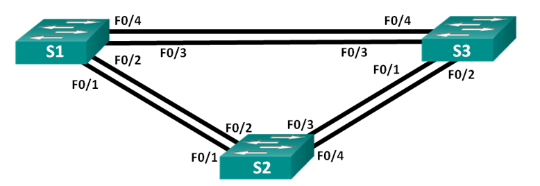

# Развертывание коммутируемой сети с резервными каналами
### Топология

### Таблица адресации
| Устройство  | Интерфейс | IP-адрес   | Маска подсети |
|-------------|-----------|------------|---------------|
| S1          | VLAN 1    |192.168.1.1 |255.255.255.0  |
| S2          | VLAN 1    |192.168.1.2 |255.255.255.0  |
| S3          | VLAN 1    |192.168.1.3 |255.255.255.0  |
### Цели
1. Создание сети и настройка основных параметров устройства
2. Выбор корневого моста
3. Наблюдение за процессом выбора протоколом STP порта, исходя из стоимости портов
4. Наблюдение за процессом выбора протоколом STP порта, исходя из приоритета портов
### 1. Создание сети и настройка основных параметров устройства
#### Шаг 1. Создайте сеть согласно топологии.
Подключаем устройства, как показано в топологии, и подсоедините необходимые кабели.
#### Шаг 2:	Выполните инициализацию и перезагрузку коммутаторов.
#### Шаг 3:	Настройте базовые параметры каждого коммутатора.
Входим в привилегированный режим.    
Входим в режим глобальной конфигурации.   
Отключаем интерпретацию команды как DNS имя - на случай ввода команды с ошибкой.   
Задаем имя коммутатора.   
Включаем шифрование паролей.   
Устанавливаем пароль для доступа к коммутатору через консольный кабель и включаем доступ к пользовательскому режиму.   
Устанавливаем локальный пароль доступа в привилегированный режим консоли.   
Задаем баннерное сообщение при входе в систему.    
```
enable
configure terminal
no ip domain-lookup
hostname S1
service password-encryption
line console 0
password cisco
login
enable secret class
banner motd @--- Unauthorized access is strictly prohibited ---@
```
Настраиваем приостановку вывода системных сообщений в момент ввода команды для консольного канала.
```
line console 0
logging synchronous
```
Задаем IP-адрес, указанный в таблице адресации для VLAN 1.
```
interface vlan 1
ip address 192.168.1.1 255.255.255.0
no shutdown
```
Сохраняем текущую конфигурацию в файл загрузочной конфигурации с использованием команды ***copy running-config startup-config***.    
**Повторяем процедуру для каждого коммутатора.**
#### Шаг 4:	Проверьте связь.
Проверяем способность устройств обмениваться эхо-запросами.    
Эхо запросы от коммутатора S1 до коммутаторов S2 и S3, а также от коммутатора S2 до коммутатора S3 выполняются успешно.
```
S1#ping 192.168.1.2
Type escape sequence to abort.
Sending 5, 100-byte ICMP Echos to 192.168.1.2, timeout is 2 seconds:
!!!!!
Success rate is 100 percent (5/5), round-trip min/avg/max = 0/0/0 ms

S1#ping 192.168.1.3
Type escape sequence to abort.
Sending 5, 100-byte ICMP Echos to 192.168.1.3, timeout is 2 seconds:
!!!!!
Success rate is 100 percent (5/5), round-trip min/avg/max = 0/0/1 ms
```
### 2. Определение корневого моста
#### Шаг 1:	Отключите все порты на коммутаторах.
```
interface range g0/1 - 2
shutdown
interface range fa0/1 - 24
shutdown
```
Повторяем для всех коммутаторов.    
#### Шаг 2:	Настройте подключенные порты в качестве транковых.
```
interface range fa0/1 - 4
switchport mode trunk
```
Повторяем для всех коммутаторов.    
#### Шаг 3:	Включите порты F0/2 и F0/4 на всех коммутаторах.
```
interface range fa0/2, fa0/4
no shutdown
```
Повторяем для всех коммутаторов.    
#### Шаг 4:	Отобразите данные протокола spanning-tree.
Вводим команду ***show spanning-tree*** на всех трех коммутаторах.    
**Коммутатор S1:**
```
VLAN0001
  Spanning tree enabled protocol ieee
  Root ID    Priority    32769
             Address     0001.6394.5B10
             Cost        19
             Port        2(FastEthernet0/2)
             Hello Time  2 sec  Max Age 20 sec  Forward Delay 15 sec

  Bridge ID  Priority    32769  (priority 32768 sys-id-ext 1)
             Address     0090.0C16.9D97
             Hello Time  2 sec  Max Age 20 sec  Forward Delay 15 sec
             Aging Time  20

Interface        Role Sts Cost      Prio.Nbr Type
---------------- ---- --- --------- -------- --------------------------------
Fa0/2            Root FWD 19        128.2    P2p
Fa0/4            Altn BLK 19        128.4    P2p
```
**Коммутатор S2:**
```
VLAN0001
  Spanning tree enabled protocol ieee
  Root ID    Priority    32769
             Address     0001.6394.5B10
             This bridge is the root
             Hello Time  2 sec  Max Age 20 sec  Forward Delay 15 sec

  Bridge ID  Priority    32769  (priority 32768 sys-id-ext 1)
             Address     0001.6394.5B10
             Hello Time  2 sec  Max Age 20 sec  Forward Delay 15 sec
             Aging Time  20

Interface        Role Sts Cost      Prio.Nbr Type
---------------- ---- --- --------- -------- --------------------------------
Fa0/2            Desg FWD 19        128.2    P2p
Fa0/4            Desg FWD 19        128.4    P2p
```
**Коммутатор S3:**
```
VLAN0001
  Spanning tree enabled protocol ieee
  Root ID    Priority    32769
             Address     0001.6394.5B10
             Cost        19
             Port        2(FastEthernet0/2)
             Hello Time  2 sec  Max Age 20 sec  Forward Delay 15 sec

  Bridge ID  Priority    32769  (priority 32768 sys-id-ext 1)
             Address     000A.4171.0536
             Hello Time  2 sec  Max Age 20 sec  Forward Delay 15 sec
             Aging Time  20

Interface        Role Sts Cost      Prio.Nbr Type
---------------- ---- --- --------- -------- --------------------------------
Fa0/4            Desg FWD 19        128.4    P2p
Fa0/2            Root FWD 19        128.2    P2p
```
MAC-адреса коммутаторв:     
- S1: 0090.0C16.9D97     
- S2: 0001.6394.5B10     
- S3: 000A.4171.0536    
Отмечаем роль и состояние всех активных портов на каждом коммутаторе:

| Коммутатор | Порт    | Роль             | Состояние |
|------------|---------|------------------|-----------|
| S1         | Fa0/2  | Root Port        | Forwarding|
| S1         | Fa0/4  | Alternate Port   | Blocking|
| S2         | Fa0/2  | Designated Port  | Forwarding|
| S2         | Fa0/4  | Designated Port  | Forwarding|
| S3         | Fa0/2  | Root Port        | Forwarding|
| S3         | Fa0/4  | Designated Port  | Forwarding|
### 3. Наблюдение за процессом выбора протоколом STP порта, исходя из стоимости портов
#### Шаг 1. Определите коммутатор с заблокированным портом
Мы отметили, что заблокирован порт Fa0/4 на коммутаторе S1.
#### Шаг 2. Измените стоимость порта
Изменяем стоимость активного (не заблокированного) порта на коммутаторе S1 до 18:   
```
interface fa0/2
spanning-tree vlan 1 cost 18
```
#### Шаг 3. Просмотрите изменения протокола spanning-tree
Повторно выполняем команду ***show spanning-tree*** на обоих коммутаторах некорневого моста (S1 и S3).    
S1# **show spanning-tree**
```
VLAN0001
  Spanning tree enabled protocol ieee
  Root ID    Priority    32769
             Address     0001.6394.5B10
             Cost        18
             Port        2(FastEthernet0/2)
             Hello Time  2 sec  Max Age 20 sec  Forward Delay 15 sec

  Bridge ID  Priority    32769  (priority 32768 sys-id-ext 1)
             Address     0090.0C16.9D97
             Hello Time  2 sec  Max Age 20 sec  Forward Delay 15 sec
             Aging Time  20

Interface        Role Sts Cost      Prio.Nbr Type
---------------- ---- --- --------- -------- --------------------------------
Fa0/2            Root FWD 18        128.2    P2p
Fa0/4            Desg FWD 19        128.4    P2p
```
S3# **show spanning-tree**
```
VLAN0001
  Spanning tree enabled protocol ieee
  Root ID    Priority    32769
             Address     0001.6394.5B10
             Cost        19
             Port        2(FastEthernet0/2)
             Hello Time  2 sec  Max Age 20 sec  Forward Delay 15 sec

  Bridge ID  Priority    32769  (priority 32768 sys-id-ext 1)
             Address     000A.4171.0536
             Hello Time  2 sec  Max Age 20 sec  Forward Delay 15 sec
             Aging Time  20

Interface        Role Sts Cost      Prio.Nbr Type
---------------- ---- --- --------- -------- --------------------------------
Fa0/4            Altn BLK 19        128.4    P2p
Fa0/2            Root FWD 19        128.2    P2p
```
После уменьшения стоимости порта fa0/2 на коммутаторе S1, STP пересчитал топологию для выбора наиболее эффективного пути, поэтому изменились статусы портов на коммутаторах.
#### Шаг 4:	Удалите изменения стоимости порта.
Удаляем запись стоимости порта fa0/2 на коммутаторе S1, созданную ранее.
```
interface f0/2
no spanning-tree vlan 1 cost 18
```
Повторно выполняем команду ***show spanning-tree***, чтобы подтвердить, что протокол STP сбросил порт на коммутаторе некорневого моста, вернув исходные настройки порта.
```
VLAN0001
  Spanning tree enabled protocol ieee
  Root ID    Priority    32769
             Address     0001.6394.5B10
             Cost        19
             Port        2(FastEthernet0/2)
             Hello Time  2 sec  Max Age 20 sec  Forward Delay 15 sec

  Bridge ID  Priority    32769  (priority 32768 sys-id-ext 1)
             Address     0090.0C16.9D97
             Hello Time  2 sec  Max Age 20 sec  Forward Delay 15 sec
             Aging Time  20

Interface        Role Sts Cost      Prio.Nbr Type
---------------- ---- --- --------- -------- --------------------------------
Fa0/2            Root FWD 19        128.2    P2p
Fa0/4            Altn BLK 19        128.4    P2p
```
### 4:	Наблюдение за процессом выбора протоколом STP порта, исходя из приоритета портов
Включаем порты f0/1 и f0/3 на всех коммутаторах для активации избыточных путей.    
```
interface range fa0/1, fa0/3
no shutdown
```
Повторяем для всех коммутаторов.     
Ждем 30 секунд, чтобы протокол STP завершил процесс перевода портов, затем выполняем команду ***show spanning-tree*** на коммутаторах некорневого моста (S1 и S3).
S1# **show spanning-tree**
```
VLAN0001
  Spanning tree enabled protocol ieee
  Root ID    Priority    32769
             Address     0001.6394.5B10
             Cost        19
             Port        1(FastEthernet0/1)
             Hello Time  2 sec  Max Age 20 sec  Forward Delay 15 sec

  Bridge ID  Priority    32769  (priority 32768 sys-id-ext 1)
             Address     0090.0C16.9D97
             Hello Time  2 sec  Max Age 20 sec  Forward Delay 15 sec
             Aging Time  20

Interface        Role Sts Cost      Prio.Nbr Type
---------------- ---- --- --------- -------- --------------------------------
Fa0/2            Altn BLK 19        128.2    P2p
Fa0/4            Altn BLK 19        128.4    P2p
Fa0/1            Root FWD 19        128.1    P2p
Fa0/3            Altn BLK 19        128.3    P2p
```
S3# **show spanning-tree**
```
VLAN0001
  Spanning tree enabled protocol ieee
  Root ID    Priority    32769
             Address     0001.6394.5B10
             Cost        19
             Port        1(FastEthernet0/1)
             Hello Time  2 sec  Max Age 20 sec  Forward Delay 15 sec

  Bridge ID  Priority    32769  (priority 32768 sys-id-ext 1)
             Address     000A.4171.0536
             Hello Time  2 sec  Max Age 20 sec  Forward Delay 15 sec
             Aging Time  20

Interface        Role Sts Cost      Prio.Nbr Type
---------------- ---- --- --------- -------- --------------------------------
Fa0/1            Root FWD 19        128.1    P2p
Fa0/3            Desg FWD 19        128.3    P2p
Fa0/4            Desg FWD 19        128.4    P2p
Fa0/2            Altn BLK 19        128.2    P2p
```
В качестве порта корневого моста на каждом коммутаторе некорневого моста протоколом STP выбраны порты fa0/1, так как данные порты имеют минимальный MAC-адрес, по сравнению с другими активными портами.
