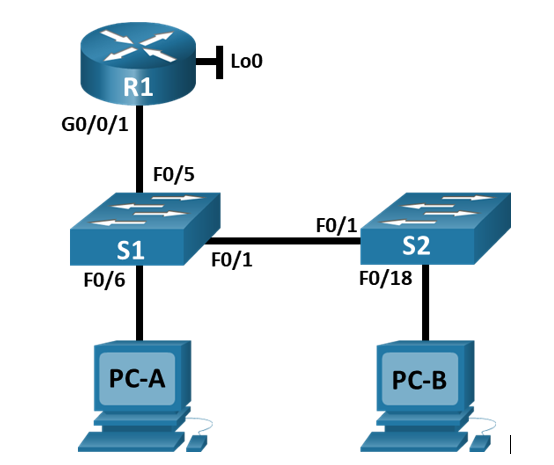

# Конфигурация безопасности коммутатора
### Топология

### Таблица адресации
| Устройство | Interface/VLAN | IP-адрес | Маска подсети |
|-----------|---------------|----------|--------------|
| R1 | G0/0/1 | 192.168.10.1 | 255.255.255.0 |
| R1 | Loopback 0 | 10.10.1.1 | 255.255.255.0 |
| S1 | VLAN 10 | 192.168.10.201 | 255.255.255.0 |
| S2 | VLAN 10 | 192.168.10.202 | 255.255.255.0 |
| PC A | NIC | DHCP | 255.255.255.0 |
| PC B | NIC | DHCP | 255.255.255.0 |
### Цели
##### Часть 1. Настройка основного сетевого устройства
•	Создайте сеть.    
•	Настройте маршрутизатор R1.    
•	Настройка и проверка основных параметров коммутатора    
##### Часть 2. Настройка сетей VLAN
•	Сконфигруриуйте VLAN 10.    
•	Сконфигруриуйте SVI для VLAN 10.    
•	Настройте VLAN 333 с именем Native на S1 и S2.    
•	Настройте VLAN 999 с именем ParkingLot на S1 и S2.    
##### Часть 3: Настройки безопасности коммутатора.
•	Реализация магистральных соединений 802.1Q.    
•	Настройка портов доступа    
•	Безопасность неиспользуемых портов коммутатора    
•	Документирование и реализация функций безопасности порта.    
•	Реализовать безопасность DHCP snooping.    
•	Реализация PortFast и BPDU Guard    
•	Проверка сквозной связанности.   
### 1. Настройка основного сетевого устройства
#### Шаг 1. Создайте сеть.
Создаем сеть согласно топологии, инициализируем устройства.
#### Шаг 2. Настройте маршрутизатор R1.
Загружаем следующий конфигурационный скрипт на R1:
```
enable
configure terminal
hostname R1
no ip domain lookup
ip dhcp excluded-address 192.168.10.1 192.168.10.9
ip dhcp excluded-address 192.168.10.201 192.168.10.202
ip dhcp relay information trust-all
!
ip dhcp pool Students
 network 192.168.10.0 255.255.255.0
 default-router 192.168.10.1
 domain-name CCNA2.Lab-11.6.1
!
interface Loopback0
 ip address 10.10.1.1 255.255.255.0
!
interface GigabitEthernet0/0/1
 description Link to S1
 ip address 192.168.10.1 255.255.255.0
 no shutdown
!
line con 0
 logging synchronous
 exec-timeout 0 0
```
Проверяем текущую конфигурацию на R1, используя команду ***show ip interface brief***.   
```
Interface              IP-Address      OK? Method Status                Protocol 
GigabitEthernet0/0/0   unassigned      YES unset  administratively down down 
GigabitEthernet0/0/1   192.168.10.1    YES manual up                    up 
Loopback0              10.10.1.1       YES manual up                    up 
Vlan1                  unassigned      YES unset  administratively down down
```
IP-адресация и интерфейсы находятся в состоянии up / up.


Шаг 3. Настройка и проверка основных параметров коммутатора
a.	Настройте имя хоста для коммутаторов S1 и S2.
Откройте окно конфигурации
b.	Запретите нежелательный поиск в DNS.
c.	Настройте описания интерфейса для портов, которые используются в S1 и S2.
d.	Установите для шлюза по умолчанию для VLAN управления значение 192.168.10.1 на обоих коммутаторах.


